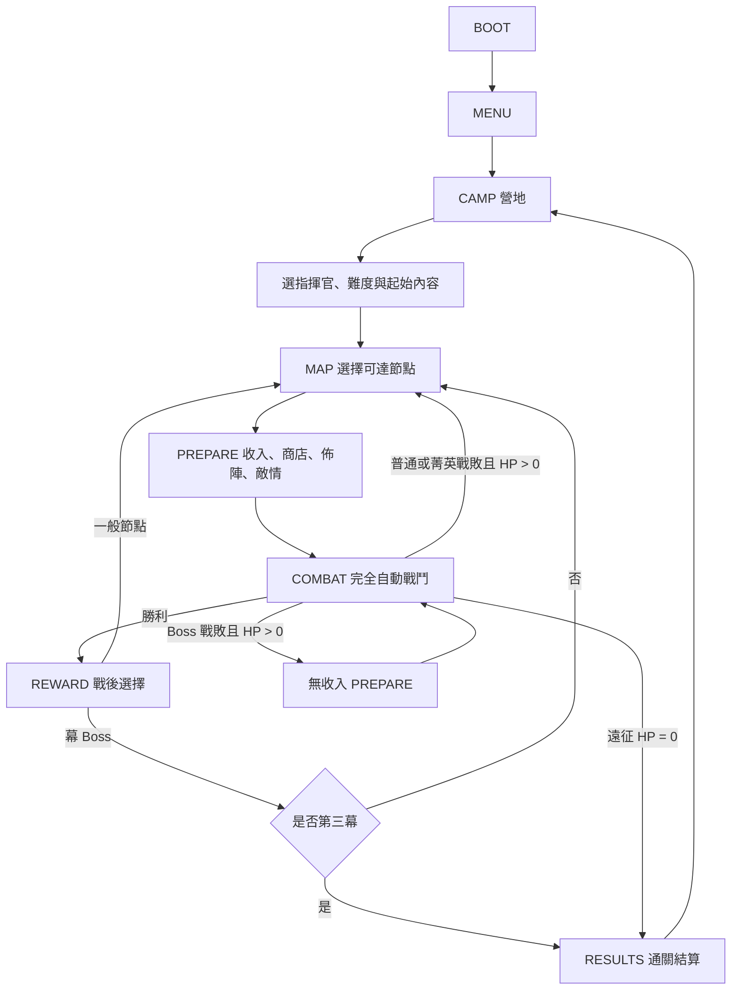

# PVE 自走棋 Roguelite 主體架構規格：核心循環與遠征流程

> 文件集入口：[game-architecture-spec.md](../game-architecture-spec.md)  
> 文件狀態：`v0.1 / Ready for external review`  
> 本檔範圍：第 4 章

---

## 4. 核心循環與遠征流程

### 4.1 狀態循環

### 4.2 一局遠征

- 遠征共三幕。
- 每幕實際走過七個節點：
  1. 固定開場普通戰。
  2. 四層分岔節點。
  3. 固定 Boss 前整備節點。
  4. 固定 Boss 節點。
- Boss 前整備固定採用既有的「休整」節點型別與第 4.3 節二選一規則，仍會開啟一般五格單位商店；它不是第八種節點類型。
- 四層分岔中，每條可完成路徑至少包含兩個戰鬥節點；加上開場戰與 Boss，每幕至少四場戰鬥。
- 分岔層寬度為 2–3 個節點；除幕起點與 Boss 外，任何節點至少有一個前驅與一個後繼。
- 地圖由 `map` 亂數流生成，並在玩家看見地圖前完整產生與保存。

- **[REQ-RUN-001]** 每場完整遠征必須包含三幕，且每幕實際經過七個節點。
- **[REQ-RUN-002]** 每幕所有合法路徑必須包含開場戰、至少兩個分岔戰鬥、Boss 前整備與 Boss。
- **[REQ-RUN-003]** 地圖不得產生斷路、無法到達 Boss、連續三個相同非戰鬥節點或沒有任何選擇的四層分岔。

### 4.3 節點類型

| 類型 | 進入時 | 完成條件 | 成功輸出 | 戰敗／取消 |
|---|---|---|---|---|
| 普通戰 | 收入、備戰、敵情 | 擊敗敵隊 | 標準三選一 | 扣 HP、無獎勵、繼續 |
| 菁英 | 收入、備戰、敵情 | 擊敗強化敵隊 | 標準三選一＋遺物三選一 | 扣 HP、無獎勵、繼續 |
| 商人 | 收入、單位商店仍可用 | 離開服務介面 | 購買成裝、消耗品或服務 | 不產生戰敗 |
| 事件 | 收入、顯示選項 | 選擇一個合法結果 | 資源、HP、棋子或規則效果 | 不可取消已確認選項 |
| 休整 | 收入、二選一 | 選擇治療或整備 | 治療 20% 最大遠征 HP，或獲得一次拆卸服務 | 不產生戰敗 |
| 寶藏 | 收入、顯示獎池 | 選擇一個獎勵 | 零件、金幣或稀有消耗品 | 不產生戰敗 |
| Boss | 首次進入給收入、備戰、敵情 | 擊敗 Boss | Boss 獎勵、下一幕或通關 | 扣 HP、原地無收入重戰 |

### 4.4 節點進入與收入順序

首次進入一個新節點時，依下列順序處理：

1. 提交 `current_node_id` 並存檔。
2. 若 `current_node_id` 不在 `income_claimed_node_ids`，結算基礎收入、利息與當前連勝獎金，再將 node ID 加入集合。
3. 產生或恢復五格單位商店。
4. 產生節點內容；戰鬥節點提交不可變的 `EncounterPreviewSnapshot`，作為敵情預覽與稍後建立戰鬥的共同敵方來源。
5. 進入備戰或節點互動。

節點收入在單一 `IncomeTransaction` 中依進入前金幣計算：`5 基礎 + min(floor(pre_gold / 10), 5) 利息 + 連勝獎金`，最後套用 99 上限；超出部分不轉換成其他資源。這筆收入與 act 內首次 2 連敗補助是不同交易與觸發時點。

Boss 重戰不得從 `income_claimed_node_ids` 移除當前節點，也不得重設商店刷新計數、節點獎勵或亂數流計數。

`BattleSetup` 不在進入節點時提前建立。玩家按下開戰後，`RunController` 必須先依當前所有人口來源推導人口、驗證部署與 roster invariant，再從已提交的 `EncounterPreviewSnapshot` 與當下合法玩家狀態建立 `BattleSetupInputs`、計算 setup hash、派生 combat stream，最後把完整 setup 與 `ResolutionState.combat_pending` 一次提交。任一步驟失敗都留在 PREPARE，且不得消耗 combat RNG。

- **[REQ-RUN-004]** 每個節點只能結算一次進入收入；重新載入、Boss 重戰或返回介面不得重複結算。
- **[REQ-RUN-005]** 所有會消耗資源或改變狀態的節點選擇必須先提交存檔，再播放結果呈現。

---

[← 產品定位、範圍與非目標](01-product-and-scope.md) · [返回文件集入口](../game-architecture-spec.md) · [遊戲系統 →](03-game-systems.md)
