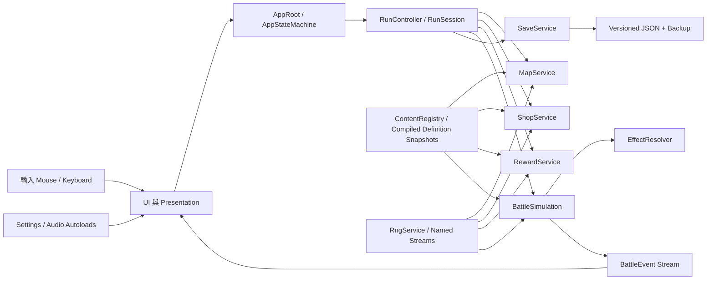
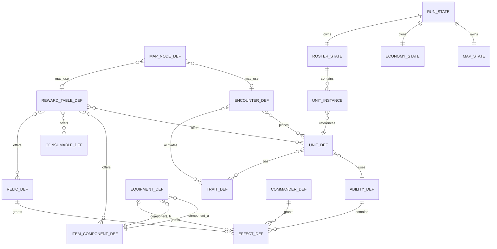

# PVE 自走棋 Roguelite 主體架構規格：技術架構

> 文件集入口：[game-architecture-spec.md](../game-architecture-spec.md)  
> 文件狀態：`v0.2 / Approved`
> 本檔範圍：第 8 章

---

<a id="section-8"></a>

## 8. 技術架構

### 8.1 工具鏈

- 引擎：[Godot 4.7 stable](https://godotengine.org/download/archive/)。
- 腳本：型別化 GDScript；公開欄位、參數、回傳值及集合元素不得省略型別。
- 測試：[GUT 9.7.1](https://github.com/bitwes/Gut/releases/tag/v9.7.1)，與 Godot 4.7 相容版本。
- 內容：Godot 自訂 `Resource`（`.tres`）作為 authoring format；執行期唯讀語意由編譯 snapshot 邊界保證。
- 執行期存檔：UTF-8 JSON。

版本升級必須新增 `DEC-*` 紀錄、固定依賴版本、重跑 migration、PRNG、canonical 戰鬥與完整 headless 測試。

- **[REQ-TECH-001]** 垂直切片必須鎖定 Godot 4.7 stable、型別化 GDScript 與相容的 GUT 9.7.1，不得使用浮動最新版依賴。

### 8.2 架構原則

1. **Domain 與 Presentation 分離**：規則不依賴畫面、動畫、輸入或 SceneTree 順序。
2. **資料定義與執行狀態分離**：`Resource` 只供編輯與啟動編譯，執行期規則使用 value snapshot，DTO 是可序列化狀態。
3. **單一狀態擁有者**：`RunSession` 只由 `AppRoot` 持有；畫面透過服務要求變更。
4. **明確服務邊界**：不用萬用 `SignalBus`、Service Locator 或任意跨畫面寫狀態。
5. **先提交再呈現**：消耗、隨機選項與戰果先存檔，再播放 UI／VFX。
6. **穩定識別與可遷移**：存檔只引用 stable ID，不引用顯示名、enum 序號或檔案排序。

### 8.3 模組與資料流



### 8.4 應用與遠征狀態

主場景的常駐節點路徑固定為 `Main/AppRoot`；`SceneRouter` 只能替換 AppRoot 下的 presentation 容器，不得卸載或重建 AppRoot 來切換畫面。

應用狀態：

| 狀態 | 擁有畫面 | 允許進入 | 允許離開 |
|---|---|---|---|
| BOOT | 啟動／migration | 程式啟動 | MENU；致命錯誤畫面 |
| MENU | 主選單 | BOOT、CAMP | CAMP、離開遊戲 |
| CAMP | 營地 | MENU、RESULTS | RUN、MENU |
| RUN | 遠征容器 | CAMP、載入有效 active run | RESULTS、CAMP（放棄） |
| RESULTS | 結算 | RUN 結束 | CAMP |

遠征狀態：

| 狀態 | 可變操作 | 下一狀態 |
|---|---|---|
| MAP | 選擇可達節點 | PREPARE／節點互動 |
| PREPARE | 商店、升級、佈陣、鍛造、敵情 | COMBAT |
| COMBAT | 暫停、倍速、檢視；不改規則 | REWARD、MAP、PREPARE、RESULTS |
| REWARD | 選取已提交候選 | MAP、RESULTS |

無戰鬥的事件、商人、休整與寶藏由 `RunController` 的節點子狀態處理，不新增全域 AppState。

- **[REQ-TECH-002]** 所有應用與遠征狀態轉移必須經 `RunController.transition()` 或 AppStateMachine；畫面不得直接改寫 `RunState`。

### 8.5 Autoload 與狀態擁有權

允許的 Autoload：

| Autoload | 責任 | 禁止責任 |
|---|---|---|
| ContentRegistry（實作型別 `ContentRegistryService`） | 載入、驗證、解析唯讀定義 | 持有當前遠征 |
| SaveService（實作型別 `SaveRepository`） | 存讀、備份、migration | 改變遊戲規則 |
| SettingsService | 顯示、音量、輸入偏好 | 持有棋子或商店 |
| AudioService | 音樂、SFX、bus | 決定戰鬥事件 |
| SceneRouter | 載入／替換畫面 | 儲存 domain 狀態 |

`RunSession`、`RunController` 與當前 `RunState` 由常駐 `AppRoot` 擁有。離開 RUN 後應釋放 RunSession；完成結算並成功存檔前不得清除結果。

Autoload 名稱是 SceneTree 中的單例實例名；其腳本不得宣告相同的 `class_name`。因此 `ContentRegistry`／`SaveService` 只作 Autoload 名稱，對應可測試型別固定為 `ContentRegistryService`／`SaveRepository`，避免 GDScript 全域符號碰撞。

### 8.6 建議專案結構

```text
res://
  app/                 # AppRoot、狀態機、組裝
  domain/
    battle/            # 純模擬、事件、效果處理
    run/               # 遠征、節點、經濟、獎勵
    meta/              # Profile、解鎖、挑戰
    common/            # Stable ID、結果型別、整數數學
  content/
    definitions/       # Resource 類別
    data/              # .tres 內容
    validation/        # 內容驗證器
  presentation/
    battle/            # 戰鬥畫面與動畫
    camp/              # 營地
    map/               # 節點地圖
  ui/                  # 共用 Control、tooltip、accessibility
  services/            # Save、Settings、Audio、SceneRouter
  tests/
    unit/
    integration/
    soak/
    fixtures/
```

此結構是模組邊界，不要求每個型別各一個資料夾；不得因整理路徑而改變 stable ID。

### 8.7 公開服務契約

以下為邏輯介面；實作可使用 class 或明確組合物件，但名稱、所有權與錯誤語意不得混淆。

```gdscript
class_name ContentRegistryService
func resolve(content_ref: ContentRef) -> ContentResolveResult
func try_resolve(content_ref: ContentRef) -> ContentDefinitionView
func validate_all() -> ContentValidationReport

class_name RunController
func transition(event: RunEvent) -> RunTransitionResult
func dispatch(command: RunCommand) -> CommandResult
func view_state() -> RunViewState
func can_transition(event: RunEvent) -> bool

class_name ShopService
func generate_offers(request: GenerateOffersRequest) -> ShopTransaction
func quote_buy(request: BuyOfferRequest) -> ShopTransaction
func quote_sell(request: SellUnitRequest) -> ShopTransaction

class_name BattleSimulation
func initialize(setup: BattleSetup) -> BattleInitializationResult
func step() -> BattleStepResult
func is_finished() -> bool
func result() -> BattleResultQuery

class_name EffectResolver
func resolve(trigger: EffectTrigger, context: EffectContext) -> EffectResolutionResult

class_name SaveRepository
func save(state: SaveRoot) -> SaveResult
func load() -> LoadResult
func migrate(raw_json_text: String) -> MigrationResult

class_name RngService
func derive_stream(
    run_seed: U64Bits,
    stream_name: StringName,
    context_id: StringName
) -> RngDeriveResult
```

`RunController.dispatch()` 與 `transition()` 都走同一個交易管線：從 canonical `RunState` 深拷貝 draft、套用 typed command／service transaction、重算衍生值、驗證 invariant、組成候選 `SaveRoot`、等待 `SaveRepository.save()` 成功，才一次替換 RunSession 的 canonical state 並發布新 `RunViewState`。若驗證或存檔失敗，必須丟棄 draft、保留舊 canonical state、回傳 typed error，且不得發出成功訊號或呈現不可逆結果。

`RunViewState` 是與 canonical state 無共享可變集合的唯讀深拷貝；UI 不得取得 `RunState`。`ShopService` 等 domain service 只讀 request snapshot 並回傳 operation／ledger 組成的 transaction，不直接修改 canonical state。服務方法不得以未型別化 `Dictionary` 作為跨模組公開契約；JSON 轉換只存在 `SaveRepository` 內部邊界。

公開服務失敗契約：

| 服務 | 失敗條件 | 必要結果 |
|---|---|---|
| ContentRegistry | manifest digest／ID 缺失、alias／版本不相容、snapshot 未編譯 | `ContentResolveResult.error` 含 digest、ID 與原因；required boot content 使 BOOT 失敗，`try_resolve` 才可回 null |
| RunController | command／transition 非法、invariant 或 save 失敗 | typed rejection；canonical state、serial、RNG 與成功事件全不變 |
| ShopService | 金幣／空間／副本不足、offer stale、owner 不符 | 無 mutation 的 rejected `ShopTransaction`；draft RNG snapshot 不提交 |
| BattleSimulation | setup schema／hash／引用不符，或在錯誤 lifecycle 呼叫 step／result | initialize 留在 UNINITIALIZED；step／result 回 typed state error，不產生部分事件或推進 RNG |
| EffectResolver | 未知 operation、參數越界、非法 target | 整個 resolution error，該 trigger 不套用部分 operation；內容驗證理應先阻止 |
| SaveRepository | 驗證、migration、I/O、rename 或 read-back 失敗 | `SaveResult`／`LoadResult` 帶診斷，保留 committed copy，RunController 不 swap |
| RngService | u64／stream name／context codec 不合法 | `RngDeriveResult.error`，不建立或消耗任何 stream |

- **[REQ-TECH-003]** 跨模組公開介面必須使用具名型別或 typed collection；未型別化 Dictionary 只能存在 JSON／引擎邊界，不得成為 domain 契約。
- **[REQ-TECH-004]** RunState 的所有變更必須經 RunController 的 copy-validate-save-swap 交易；UI 與 domain service 不得取得或保留 canonical state 的可變引用。
- **[REQ-TECH-005]** Autoload 實例名與 `class_name` 必須使用第 8.5 節的不同名稱，且由靜態檢查阻止全域符號碰撞。
- **[REQ-TECH-006]** 除明確表示 optional lookup 的 `try_resolve()` 外，所有公開服務的可失敗操作必須回傳具名 result／error，遵守本節 no-partial-mutation 契約，不得以 silent null、assert 或半套用狀態處理正常資料錯誤。

### 8.8 內容定義 Resource

所有 authoring 內容定義繼承 `ContentDefinition`，至少具有 `id: StringName`、`schema_version: int`、顯示 key、解鎖條件與資產引用。

| 型別 | 核心欄位 | 主要消費者 |
|---|---|---|
| UnitDef | 費用、標籤、stats、ability_id、AI、資產 | Shop、Battle、Codex |
| TraitDef | 成員規則、門檻、效果、說明 | Roster、Battle、UI |
| AbilityDef | 法力、目標、cast、effects | Battle、Preview |
| EffectDef | trigger、conditions、typed operations、stacking | EffectResolver |
| ItemComponentDef | 配方 key、圖示 | Forge、Reward |
| EquipmentDef | 兩零件、stats、effects、unique_group | Forge、Battle |
| ConsumableDef | 使用時機、typed run operations、堆疊上限、資產 | Reward、Roster、Run |
| RelicDef | 類別、effects、啟用限制 | Reward、Run、Battle |
| CommanderDef | 起始包、被動、路線偏好 | Camp、Run |
| EncounterDef | 敵隊、站位、詞綴、preview | Map、Battle |
| RewardTableDef | 候選類型、權重、條件 | RewardService |
| MapNodeDef | 類型、內容生成器、進出規則 | MapService |
| UnlockDef | 里程碑、貨幣成本、解鎖 ID | Meta |
| EconomyConfigDef | 收入、利息、價格、XP、機率、卡池數量 | Shop、Run、UI |
| MetaRewardTableDef | 節點分數、通關獎勵、挑戰倍率 | Results、Meta |
| CombatConfigDef | tick、行動進度、回魔、阻抗、決勝期、遠征傷害、安全 budget | Battle、Preview、Validation |

`BattleOperationDef` 與 `RunOperationDef` 是 `EffectDef` 內嵌的具型別 subresource，不是可獨立解鎖的 registry 內容，因此不各自配置 stable ID。前者只能描述 battle-local operation；後者只能描述交由 RunController 提交的持久 operation，兩者不可互相代用。

`CombatConfigDef` 固定 ID 為 `config.combat_default`，且必須列入每個 run pinned generation 的 active IDs。固定規則欄位只接受：simulation 1、20 tick/s、8×8、soft/hard 1200/1800、progress scale 1000、resistance base 100、basis points 10000、overtime interval 20 tick、每 tick 每 entity 一次主行動；這些不是 TUNE。TUNE 的 default／inclusive range 固定為：attack mana `10／0..100`；damage mana factor `10／1..100`、min/max `1/10／0..100且min≤max`；overtime step/cap `200/2000／step 1..1000且cap step..10000`；act base `6/10/14／各1..100`；survivor/Boss damage `2/10／各0..100`；effect/operation/event/entity budgets `4096/8192/16384/64`，前三者 64..65535、operation≥effect，entity 64..1024且不得低於內容計算值。固定值不符、缺少、重複或越界皆阻止內容編譯；公式只讀 setup snapshot，不硬編 default。

Godot `Resource`、nested Array 與 subresource 都是可變且同一路徑可能共用實例，因此「唯讀」不能只靠團隊約定。`ContentRegistryService` 在 BOOT 載入 authoring Resource 後，必須先做 schema／引用驗證，再依 stable ID 排序編譯為 `ContentCatalogSnapshot`：只含規則所需的基本型別、typed value DTO、asset path 與無共享集合的深拷貝，並以 canonical bytes 計算 manifest digest。原始 Resource 只留在 registry 的 authoring cache，絕不交給 UI、RunSession 或 domain。

`ContentRef` 固定包含 `manifest_digest` 與 `content_id`；`resolve()`／`try_resolve()` 不提供只傳 content ID 或偷偷使用 latest catalog 的 overload。active RunSession 的每次 query 都必須從 `RunState.content_snapshot.manifest_digest` 建立 ref；CAMP／新遠征預覽則使用明確取得的 latest catalog handle。如此同一 stable ID 在新舊 generation 可同時解析而不混用。

`resolve()` 成功時在 `ContentResolveResult.value` 回傳 `ContentDefinitionView` 深拷貝；其 nested collection 與 registry canonical snapshot 不共享引用。domain request／`BattleSetupInputs` 取得指定 catalog generation 的 value snapshot，不取得 Resource。UI 若修改自己的 view，只能破壞該 view；下次 query 會由同一 `ContentRef` 的 canonical snapshot 重建。熱重載必須完整重編譯、驗證並產生新 catalog generation／digest，不能原地改 active run 使用的 generation；registry 以 manifest digest 保留所有仍被 RunSession 引用的舊 catalog，直到引用釋放。重新啟動時若存檔所需 digest 未安裝，依第 9.8 節隔離不相容 run。視覺資產以 path／stable asset ID 交給 presentation 載入，不讓 Texture／Resource 物件進入規則 hash。

- **[REQ-DATA-001]** 所有可擴充遊戲內容必須由具 stable ID 的 Resource 定義，UI 與 domain 不得各自維護重複規則資料。
- **[REQ-DATA-008]** Authoring Resource 必須在 BOOT 編譯成 registry-owned canonical value snapshot；任何 consumer 只能以含 manifest digest 的 ContentRef 取得無共享可變集合的 view／request snapshot，不得取得原始 Resource、隱式改用 latest catalog 或改變 manifest 未察覺。

### 8.9 執行期 DTO

| DTO | 必要資料 | 擁有者 |
|---|---|---|
| ProfileState | profile_id、next_run_serial、貨幣、解鎖、發現、挑戰、settlement receipts、設定引用 | AppRoot／Save |
| RunState | seed、內容快照、next transaction／instance serials、幕、節點、HP、指揮官、resolution union、子狀態 | RunSession |
| RunViewState | UI 所需的深拷貝唯讀投影 | RunController |
| ContentCatalogSnapshot | 由 authoring Resource 編譯的 canonical 規則值與 manifest digest | ContentRegistryService |
| ContentRef | manifest_digest＋content_id，明確選取 catalog generation | Consumer request |
| ContentDefinitionView | 單一內容的 consumer 深拷貝投影 | ContentRegistryService |
| ContentSnapshotState | content_version、排序後 enabled IDs、config IDs、manifest digest | RunSession |
| MapState | node graph、current_node_id、已完成節點 | RunSession |
| EconomyState | 金幣、等級、XP、連勝／連敗、補助旗標 | RunSession |
| UnitPoolState | 各 UnitDef 剩餘／保留／持有副本 | RunSession |
| RosterState | 棋盤、板凳、物品庫、overflow、五個遺物槽 | RunSession |
| BoardState | 8×8 格位與 UnitInstance 引用 | RosterState |
| UnitInstance | instance_id、def_id、星級、裝備、持久局內狀態 | RosterState |
| ShopOffer | offer_id、unit_def_id、費用、保留副本 | EconomyState |
| EncounterPreviewSnapshot | 已提交的敵隊、站位、羈絆、招式、階段、詞綴 | RunSession |
| BattleSetupInputs | canonical hash 的全部規則輸入，不含 seed、hash、UI | RunController |
| BattleSetup | inputs、codec/simulation/hash/RNG versions、setup hash、combat RNG snapshot、envelope digest；不保存 combat seed | ResolutionState |
| BattleEvent | tick、sequence、type、source、targets、typed payload | BattleSimulation |
| BattleResult | outcome、tick、存活者、遠征傷害、摘要、run effect intents | ResolutionState |
| ResolutionState | `idle`／`combat_pending`／`battle_result_pending`／`reward_pending` tagged union | RunState |
| PendingRewardState | node、stage、已提交 offers、reserved copies、choice、transaction ID | ResolutionState |
| RunMutationProposal | typed scalar run operation、claim scope、source instance/slot、effect／operation index、payload digest | BattleResult／RunController |
| LoadResult | profile 狀態、run 狀態、診斷、保留檔路徑 | SaveRepository |

- **[REQ-DATA-002]** 所有需要存檔或跨畫面傳遞的執行狀態必須使用明確 DTO，不得保存 Node、Callable、Resource 實例或 SceneTree 路徑。

### 8.10 效果系統

`EffectDef` 使用有限、可驗證的詞彙，而不是任意腳本路徑。首切片至少支援：

- Trigger：`battle_start`、`attack`、`hit`、`damaged`、`cast`、`kill`、`death`、`periodic`、`battle_end`。
- Condition：來源／目標標籤、生命門檻、距離、狀態、有無裝備、每戰次數。
- Battle Operation：傷害、治療、護盾、加／減 battle-local stats、套用／移除狀態、位移、召喚、給予法力。
- Run Operation：金幣、XP、卡池、物品、遺物、遠征 HP 或人口來源；只能由 RunController 在戰鬥外提交。事件／獎勵可透過其既有選擇或 overflow 狀態處理容量型輸出。
- Stacking：`replace`、`refresh_duration`、`add_stacks`、`independent`，並有 `max_stacks`。

首版有限 enum 固定為：Ability target `self/current_target/nearest_enemy/random_enemy/lowest_health_ally`；Operation target `self/target/all_allies/all_enemies`；Scaling `flat/attack`；Damage `physical/magical/true`；Move `forward/toward_target/away_from_target`；Summon placement `adjacent`；AI profile `frontline`。未知值不是可忽略的擴充點，內容編譯與 runtime resolution 都必須整體拒絕。

Trigger lifecycle固定為：`battle_start`在首次step的tick1、spawn event後且regular phase前，依challenge→commander→relic slot→trait ID→encounter affix→equipment owner cell/slot→unit side/cell/ID，再依effect priority/ID→operation→target恰一次；`attack`在合法普攻接受後、命中前；`hit`在attack damage套用後；`damaged`只在shield＋health正承傷後；`cast`只在鎖定target成功resolve、ability effects前，start/fizzle不觸發；同wave死亡的`kill`先於`death`；`periodic`只在`tick % interval == 0`；`battle_end`在outcome固定後依全部曾instantiate的source states執行，v1只允許run intent、不發presentation，最後才由simulation發battle_finished。

Setup v2 effect assignment exact欄為 `priority,source_category,source_side,source_stable_id,source_instance_id?,source_slot,effect_index,effect_id,targets,int/id params`，category rank為challenge/commander/relic/trait/encounter_affix/equipment/unit。challenge、commander、relic、equipment分別只來自對應頂層array；trait/unit assignment嵌在各snapshot；affix只來自encounter。equipment必保存owner run-unit ID與slot0..2，relic保存slot0..4；unit保存自身instance，global source為null。location/category/owner/slot不符阻止setup，reload不得讀RunState/registry補值。

unit與equipment綁owner entity且可用九種trigger；其餘global source只可用battle_start/periodic/battle_end、僅允許flat＋all-allies/all-enemies或合法run intent，challenge/encounter-affix/enemy source連run intent也禁止。ability effects只由successful cast resolve執行；battle_end含已死亡owner與summon assignments。canonical category內順序為challenge/commander stable ID、relic slot、trait/affix side＋stable ID、equipment owner cell/slot/ID、unit side/cell/ID，再接assignment tuple。

Target tie-break 固定為：nearest 使用可達 attack-position path cost→front rank→instance ID；random 先按 instance ID 排序，0 個不施法、1 個不抽 RNG、2 個以上恰一次 bounded draw；lowest-health ally 包含 self，依 health ratio 的整數交叉乘積→current health→cell→instance ID。cast target 在 start tick 鎖定且 random draw也只在該時消耗；到期無效只 fizzle，不重鎖或抽 RNG。`current_target`／operation `target` 缺失時 ability 不施法／resolution 整體失敗；all targets 依 cell→ID。Move forward 為 player +y、enemy -y；`cells>1` 從更新後 cell逐格重算 toward/away，每步檢查 corner/邊界/occupancy，首個非法步停止，成功一格一 event，0格成功 no-op。Adjacent summon 依 `N,NE,E,SE,S,SW,W,NW` 逐格保留，不抽 RNG；候選耗盡發具名 failure event。

ConditionDef v2 固定 `kind,subject,comparator,int?,stable_id?,max_uses?`：source/target tag 使用對應 subject＋`has`＋Trait ID；health below/above 使用 source或target＋`lt/gt`＋0..10000，採整數交叉乘積嚴格比較；distance at most/least 使用 source_target＋`lte/gte`＋0..7 Chebyshev；has/lacks status 使用 source或target＋`has/not_has`＋status-marker EffectDef ID；has equipment 使用 `has`＋EquipmentDef ID；max uses 使用 effect＋`lt`＋1..99。未列 optional 必須 absent；conditions 排序後 AND。periodic interval 對 periodic 為1..1800、其他 trigger 恰為0。

九種 BattleOperation v2 參數固定為：damage/heal `base 0..i32max,flat/attack,target`（attack=base+source attack）；damage另有三種 type；shield `amount,duration 1..1800,target`；modify stat只允許 attack/armor/magic_resist/attack_speed_milli/move_speed_milli 與 add/multiply_bps（multiply 0..100000）、duration 1..1800、target；apply/remove status 使用 status-marker ID（apply stacks1..99/duration1..1800）；move只移 source且使用三方向、cells1..7；summon使用 unit ID、count/max-active1..64、adjacent；grant mana非負且clamp。有效 stat 先加總 add，再用 `10000+sum(each multiplier-10000)` 合併倍率並一次 floor；attack/speed clamp 非負，armor/resist clamp i32。Target 只允許 self/target/all_allies/all_enemies。EffectDef 的 RunOperation 只允許三種非負 scalar與 once_per_node/on_first_clear。缺 source、overflow 或未知參數使整個 resolution rollback。

四種 stacking 精確語意如下：`replace` 以 `(amount, duration, source identity)` canonical tuple 較大者替換，較小者不改狀態；`refresh_duration` 保持既有 stack/amount 並把剩餘時間設為兩者較大值；`add_stacks` 將 stacks 相加並 clamp `max_stacks`，duration 取較大值；`independent` 依 `(status/effect ID, source instance, operation index, application sequence)` 各自保存。Status 在本版本只是具名 marker、stacks 與 duration；任何 stun、silence、taunt 等控制語意必須新增 typed handler、codec 與測試，不得靠 ID 字串特判。

任何無法由既有詞彙表達的特殊效果，先新增具型別參數的 operation handler、event payload codec 及測試，再建立內容；不得讓 `EffectDef` 直接執行任意 GDScript。

`EffectResolver.resolve()` 成功時在 `EffectResolutionResult.value` 回傳 `EffectResolution`，其中 `battle_operations: Array[BattleOperation]` 由 BattleSimulation 套用、`run_effect_intents: Array[RunMutationProposal]` 只附加到 `BattleResult`、`event_proposals: Array[BattleEventProposal]` 只描述可預先知道的呈現意圖。Resolver 不得猜 sequence、health_after或actual damage；Simulation 在 draft 套用 operation 後才 materialize 最終具名 `BattleEvent`。`BattleEvent` 的每個 type 都對應固定 payload DTO，禁止任意 Dictionary payload；事件 codec 固定欄位順序、整數範圍與 unknown 拒絕行為。

`BattleEventCodec v1` common 欄位依序為 `event_codec_version,tick,sequence,type,source_instance_id?,target_instance_ids[],payload`；targets 排序去重，座標 0..7、tick 0..1800。payload exact schema如下：

| type | payload fields（固定順序） |
|---|---|
| spawn | unit ID、side、origin、y、x |
| move | from y/x、to y/x |
| attack | raw damage、presentation profile |
| cast | ability ID、start/resolve/fizzle、fizzle reason(none/target_invalid/caster_death)、resolve tick |
| damage | type、raw、post-resistance、shield absorbed、health damage、health after |
| heal | requested、applied、health after |
| shield | delta、remaining、expires tick |
| mana | reason、delta、mana after |
| modifier | stat、mode、amount、expires tick、apply/expire |
| status | status ID、apply/replace/refresh/stack/remove/expire、stacks、remaining ticks |
| death | origin、y、x |
| boss_phase | phase index、HP threshold bps |
| summon_failure | unit ID、request ordinal、no_cell/entity_budget/max_active |
| battle_finished | outcome、expedition damage |

Common identity cross-field 規則：spawn source為summoner/null且target恰為新 entity；move source必填、target空；attack source必填、target恰1；cast source必填、target 0或1；damage source可null、target恰1；heal/shield/mana/modifier/status target恰1；death source為dead、target 0或1 killer；boss/summon failure source必填、target空；battle finished source null、targets恰為排序 survivors。payload 不重複這些 ID，任一矛盾拒絕。

Operation event的source是operation source entity，global則null；mana(attack) source/target皆attacker，mana(damaged) source是原damager或null、target受傷者，mana(cast_reset) source/target皆caster。shield/modifier/status expire/remove沿用保存的原applicator ID，原本global才null，即使applicator已死亡也不改寫。overtime damage source固定null。

Cast start/resolve 的 fizzle reason必為none，fizzle必為target_invalid或caster_death；不存在的remove_status仍發 `action=remove,stacks=0,remaining_ticks=0`。Damage的post-resistance是減傷公式後、shield前數值，真實傷害等於raw，負resist可使其大於raw；health damage依work order只配置剩餘health，overkill不計killer或承傷回魔，health_after永遠是u32 post-all-damage/pre-heal值。

每筆 event canonical UTF-8 bytes 以 u32 長度 framing 後串成 ordered stream；unknown/extra/missing/type/range 一律拒絕。`BattleResultCodec v1` 欄位依序為 `setup_schema=2,hash=1,rng=1,simulation=1,event=1,result=1,battle_setup_hash,outcome,final_tick,sorted survivors,expedition_damage,sorted proposals,summary_hash,result_hash`；完整version tuple進result hash，battle_result_pending只保存此唯一result即可拒絕unknown tuple。proposal identity/sort key為 `claim_scope→source_instance_or_slot→effect_id→operation_index`，operation kind/amount由payload digest綁定；相同identity同digest合併、不同digest rollback。summary hash為 `BRS1 + setup raw digest + framed events`，只在simulation完成／receipt發行時由event transcript重算；正式save不保存transcript，載入時只驗digest格式。result hash為 `BRH1 + 除 result_hash 外的result preimage`，decode必須重算並拒絕不符。

Result finalizer 要求 event stream 恰有一筆且最後一筆為 battle_finished；其 tick、targets survivors、payload outcome/expedition damage 必須逐欄等於 BattleResult，才可發行 validation receipt。v1 outcome固定後battle_end不產生presentation event，因此terminal suffix唯一event為battle_finished；CombatCoordinator只buffer這筆與outcome view，等RecordBattleResult存檔成功後才一起釋放，save失敗全部丟棄，reload由committed setup重播。

`battle_start`、`attack`、`hit`、`damaged`、`cast`、`kill`、`death` 與 `periodic` 預設只能改變 `BattleLocalState`。需要產生局內持久資源的效果必須輸出 `RunMutationProposal`，宣告 `once_per_node` 或 `on_first_clear` claim scope，且只在勝利／合法結算交易中由 RunController 提交；戰敗一律丟棄。內容驗證器必須拒絕可在 Boss 重戰反覆提交的資源效果。

任一可重新觸發既有 trigger 的 effect cycle 都必須在循環的每條可重入路徑具有有限 `max_uses_per_battle`；ContentValidator 以非零結果拒絕無界循環。BattleSimulation 另由版本化 CombatConfig 對每 tick 的 effect resolution、operation、event 與 entity 數設安全 budget；超限使整個 tick rollback，不能留下部分 operation、RNG 或 event sequence。

Sim v1 budget計數單位固定：effect counter在每個trigger/effect attempt、判condition前+1（false也計）；operation counter對一般operation每expanded target、move每requested cell、summon每requested entity +1；event counter只在materialize具sequence的event時+1，含initial spawn、expire/fizzle/failure/no-op remove/battle_finished；前三者每tick歸零。entity budget是同時alive＋death_pending＋accepted spawn reservations的peak，不是ever-created；phase5完成死亡才釋放。所有counter在draft內，下一筆超限使step fatal rollback。

垂直切片中，戰鬥來源的 `RunMutationProposal` 白名單只允許不需玩家選擇且不佔容器的非負 scalar：`add_gold`、`add_xp`、`heal_expedition_hp`；分別依 99 金上限、第 5.9.2 節 XP 規則與最大 HP 做決定性 clamp。戰鬥效果不得提出棋子、卡池 reservation、零件、成裝、消耗品、遺物、裝備拆卸、人口來源或任何替換／放棄操作；內容驗證器在匯入時拒絕。這些容量型 Run Operation 只可由事件或已序列化的 reward／overflow 流程使用，避免 `battle_result_pending` 等待一個沒有表示法的選擇。

S2 起 proposal 不再保存已綁定 run/node 的 `EffectClaimKeyState`，而保存 `claim_scope/source_instance_or_slot/effect_id/operation_index/operation_kind/amount/payload_digest` descriptor。前四欄是 claim identity。`ProposalSourceCodec v1` token只可為 `u/<run-unit>`、`c/<stable-id>`、`r/<0..4>`、`t/<stable-id>`、`eq/<owner-run-unit>/<0..2>`，全部strict ASCII並直接供S3 RuntimeKey `s:` 使用；enemy/summon來源禁止RunOperation。digest preimage固定為ASCII `RMP2`，接claim scope/source/effect ID三個 `u32 length + bytes`、operation index u32、operation kind framing與nonnegative amount u32；同identity＋digest合併，不同digest使step rollback。

- **[REQ-EFFECT-001]** 戰鬥 trigger 不得直接修改持久局內資源；所有持久變更必須具有可冪等驗證的 claim scope，並由 RunController 在合法結算時提交。
- **[REQ-EFFECT-002]** EffectResolver 必須分離 battle-local operation、持久 run intent 與 presentation event，且跨模組事件 payload 必須是可版本化的具名型別。

### 8.11 內容實體關係



---

[← 內容預算與局外成長](04-content-and-meta-progression.md) · [返回文件集入口](../game-architecture-spec.md) · [Stable ID、亂數與存檔 →](06-data-rng-and-save.md)
