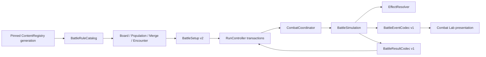

# S2 `combat-core` 技術設計

> 狀態：`Approved`
> 對應需求：[requirements.md](requirements.md)

## 1. 設計目標

S2 將 S1 的 pinned content、deterministic RNG、typed DTO、atomic save 與 RunController 交易串成純 Domain 戰鬥閉環。核心規則不依賴 Node、動畫、物理或幀率；Combat Lab 是可替換 presentation adapter。

## 2. 版本與相容策略

| 契約 | S2 版本 | 規則 |
|---|---:|---|
| content codec | 2 | 加入 `CombatConfigDef` 與 `BossPhaseDef.source_spawn_key`；保留可執行 v1 codec/golden |
| save schema | 2 | `RunMutationProposal` 改為 claim descriptor；0→1→2 逐版 migration |
| setup schema | 2 | 11個頂層欄位不變；擴充`BattleRulesSnapshot`及nested Effect/Unit/Trait snapshots |
| setup hash | 1 | SHA-256、`CanonicalBattleCodec` 對應 schema bytes；只改 digest domain/algorithm 才升版 |
| RNG | 1 | S1 PCG32/derive/bounded golden 不變 |
| simulation | 1 | 固定 tick、排序、公式與事件語意的 replay identity |
| BattleEvent codec | 1 | 固定 enum/type/payload schema |
| BattleResult codec | 1 | 固定結果、survivor、damage、proposal、summary 欄位 |

正式 S2 唯一支援 tuple 為 `(setup_schema=2,hash_version=1,rng_version=1,simulation_version=1,event_codec=1,result_codec=1)`。S1 `(setup_schema=1,hash=1,rng=1)` 只保留 codec/golden讀取，不進正式新戰鬥。欄位、順序或規則語意改變必升 setup schema／simulation version；hash_version只在相同 canonical inputs 改 hash domain或算法時升。任何未知組合在 initialize/load 時具名拒絕或 incompatible-preserved，不做部分 fallback。

schema 1 的 profile 與 `run=null` 可直接升至 2。active run 只有 `resolution=idle`、phase=MAP、`current_node_id=null` 且所有 MapNode 的 `encounter_preview=null` 才可走明確 content-generation migration；PREPARE 或任何已提交 preview 都不得改 generation。registry 必須仍持有 old pinned v1 generation，並從 migration pack 取得與該 content_version 綁定、digest allowlist 驗證的 `config.combat_default`，以及依 `encounter_id→phase_index→source_spawn_key` 排序的 Boss source mapping。mapping 必須引用同 encounter 唯一 spawn且其 canonical digest也在 allowlist；不得猜第一隻敵人。registry 將舊 canonical entry values逐筆轉碼到 codec v2、套用 mapping、加入 config，產生 receipt `(old_digest,new_digest,config_entry_digest,boss_mapping_digest,content_codec 1→2)`，再原子更新 snapshot。任一舊 generation／migration config／mapping／digest 缺失，或 schema 1 有 preview、PREPARE、reward/combat/result pending，皆保留 profile與原檔並標 `incompatible_preserved`；不讀 latest、不猜 seed或重新編譯 setup。

`BossSourceMigrationEntryV1` exact欄位為 `encounter_id:stable_id,phase_index:u32,source_spawn_key:ascii`，entry依 `encounter_id ordinal→phase_index` 排序且identity唯一；spawn key符合 `[a-z][a-z0-9_]{0,63}`。mapping bytes固定為ASCII `BSM1`、entry count u32-be，再對每entry寫 encounter ID與spawn key各自 `u32-be byte_length + strict ASCII bytes`，phase index u32-be；`boss_mapping_digest=SHA256(bytes)`。mapping必須對old generation每個Boss phase恰一筆且不得有extra，source spawn存在且唯一。

`ContentGenerationMigrationPackV1` exact欄位為 `source_content_version,source_manifest_digest,target_content_version,expected_target_manifest_digest,combat_config_entry_bytes,combat_config_entry_digest,boss_mapping_entries,boss_mapping_digest,from_codec=1,to_codec=2,pack_digest`。config digest由canonical v2 entry bytes重算；pack digest preimage為ASCII `CGM1`、兩個content version各自u32長度＋strict UTF-8、source/expected-target/config/mapping四個raw 32-byte digest、from/to u32-be。allowlist key是 `(source_content_version,source_manifest_digest,pack_digest)`；所有digest與pack逐欄重算成功後才可轉碼。

成功receipt exact欄位為 `source_manifest_digest,target_manifest_digest,combat_config_entry_digest,boss_mapping_digest,pack_digest,from_codec,to_codec,receipt_digest`；前五個digest皆raw32 canonical encode，receipt digest為 `SHA256("CGR1" + 前五個raw digest + from/to u32-be)`。轉碼後實際target manifest必須等於pack expected target，receipt才可發行並隨migration diagnostic保存；任一entry/排序/framing/digest/allowlist/target差異皆 `incompatible_preserved`。golden與逐欄破壞fixture鎖定BSM1/CGM1/CGR1。

## 3. 模組與依賴



Domain modules may depend on `domain/common`, typed compiled values and ports. Presentation depends on immutable setup/event/view copies only. Content authoring Resources never enter BattleSimulation.

## 4. Content 與備戰

### 4.1 `CombatConfigDef`

固定 ID `config.combat_default`。固定規則欄位只接受精確值：`simulation_version=1`、`tick_rate=20`、`board_width=8`、`board_height=8`、`soft_limit_ticks=1200`、`hard_limit_ticks=1800`、`progress_scale=1000`、`resistance_base=100`、`basis_points=10000`、`overtime_interval_ticks=20`、`main_actions_per_tick=1`。這些不是 TUNE，任一不同值都由 ContentValidator 拒絕。

可資料調整的 TUNE 欄位、v0.2 default 與 inclusive range 固定如下：

| field | default | range / relation |
|---|---:|---|
| attack_mana_gain | 10 | 0..100 |
| damage_mana_factor | 10 | 1..100 |
| damage_mana_min / max | 1 / 10 | 0..100 且 min≤max |
| overtime_step_bps / cap_bps | 200 / 2000 | step 1..1000；cap step..10000 |
| act1/act2/act3_base_damage | 6 / 10 / 14 | 各 1..100 |
| survivor_damage / boss_damage | 2 / 10 | 各 0..100 |
| effect_resolution_budget | 4096 | 64..65535 |
| operation_budget | 8192 | 64..65535 且 ≥ effect budget |
| event_budget | 16384 | 64..65535 |
| entity_budget | 64 | 64..1024，且不得低於 content report maximum |

缺少、重複、越界或固定欄位不符均拒絕。`config.combat_default` 必須列在每個 pinned generation 的 active IDs；BattleRuleCatalog 只以 run 的 manifest digest resolve，絕不 fallback latest。公式一律讀 BattleRulesSnapshot 對應欄位，不重新硬編 default。

`ContentCategory.COMBAT_CONFIG = 0x1010`。content codec v2 使用 v2 manifest identity；v1 encoder/decoder 與 golden fixture 不修改。

### 4.2 `BattleRuleCatalog`

`BattleRuleCatalogBuilder.build(ContentRegistryService, manifest_digest, required_ids) -> BattleRuleCatalogBuildResult` 對每個 `ContentRef(manifest_digest,id)` resolve，解碼為 immutable-style typed values：Unit、Trait、Ability、Effect、Encounter、Equipment、CombatConfig。任何缺 ID、category mismatch、codec/generation mismatch 整體失敗。catalog 對外只回 deep clone，不存在 latest overload。

### 4.3 棋盤與人口

`BoardPreparationValidator.validate(request) -> BoardValidationReport` 收集而非 fail-fast。Issue 排序固定為 `code → logical_y → logical_x → instance_id`。檢查 8×8、玩家 y=0..3、敵人 y=4..7、重疊、引用、重複 instance、人口、半場 32 格。

`PopulationCalculator.calculate(base_level, Array[PopulationSourceSnapshot])` 先依 `source_kind → source_id → source_instance_or_slot` 排序、拒絕重複 identity，再以 checked integer addition 得 `derived_capacity`。不設抽象 cap；超過 32 由 board physical bound 拒絕。

板凳是 `Array[String]` 的順序資料，最多 9；緊縮只移除不存在/移上場者並保留其餘相對順序，不以 instance ID 排序。

### 4.4 升星

`UnitMergeService.merge_all(RosterState, BattleRuleCatalog) -> UnitMergeResult` 在 draft clone 上工作，反覆處理 1→2 再 2→3，直到無 merge。

候選排序 key：`on_board desc → board_cell_index asc → bench_index asc → instance_id asc`。第一個為主體；acquired serial 取全組最小；位置保留主體位置。裝備先保留主體槽，再依 consumed-unit order 與 slot index 搬移；滿三槽或 unique group 衝突則依 inventory capacity 進 inventory，再進 overflow。`held_copies` 不變；每個 unit 的 `sum(1,3,9 by star)` 在 merge 前後相同且等於 pool held count。

### 4.5 遭遇

`EncounterCompileRequest` 只有 manifest digest、encounter ID、node ID、act/depth/challenge；不得有 roster/traits/items 或 RNG。S2 compiler 對已選定 EncounterDef 是純決定性編譯器；若未來 encounter template 需要隨機分支，MapService 必須先用 `map` stream 產生並提交 chosen spawn keys，compiler 不另建第五條或共用 combat stream。

敵軍 ID 使用獨立 `BattleEntityIdCodec v1`，不是未定義的 RuntimeKey kind：`e_ + first_16_hex(SHA256("BEI1" + len(node_id)+node_id + len(spawn_key)+spawn_key))`。長度是 big-endian u32、字串為 strict ASCII；spawn key 在 EncounterDef 內唯一，preview validator 對所有 player/enemy ID 做 collision check，collision 直接拒絕、不重抽。

召喚 ID 為 `s_ + first_16_hex(SHA256("BSI1" + setup_hash raw bytes + framed summoner ID + framed effect ID + u32 operation_index + u32 summon_request_serial))`。每summoner instance的serial從0開始；每個requested entity先取目前serial作 `request_ordinal`／ID preimage，再在draft加一。active key固定為 `(summoner_instance_id,effect_id,operation_index,unit_id)`，計數含alive、death_pending與同step accepted reservations；spawn side沿用summoner side、anchor為trigger時保存的summoner cell。每個request依 `max_active→entity_budget→adjacent cell` 順序檢查，首個失敗原因唯一決定 `summon_failure`；no-cell掃固定八方向。成功才reserve cell/entity。成功與failure都消耗draft serial並計operation/event budget；整個step rollback時serial、reservation與event皆不提交。與任何既有entity ID collision使step整體fatal，不retry或消耗RNG。

`BossPhaseDef.source_spawn_key` 必須指向 encounter 內唯一 spawn。preview 的 `BossPhaseSnapshot.source_instance_id` 直接保存編譯結果；runtime 不猜測第一隻敵人。

## 5. BattleSetup v2

`BattleSetupInputs` 頂層保持 11 欄。`BattleRulesSnapshot` v2 exact field order 為：

`simulation_version,event_codec_version,result_codec_version,combat_config_id,tick_rate,board_width,board_height,soft_limit_ticks,hard_limit_ticks,progress_scale,resistance_base,basis_points,overtime_interval_ticks,main_actions_per_tick,attack_mana_gain,damage_mana_factor,damage_mana_min,damage_mana_max,overtime_step_bps,overtime_cap_bps,act1_base_damage,act2_base_damage,act3_base_damage,survivor_damage,boss_damage,effect_resolution_budget,operation_budget,event_budget,entity_budget,act_index,encounter_kind,ability_rules,effect_rules,summoned_unit_templates`。

`BattleAbilityRuleSnapshot` 依 ability ID 排序，欄位為 `ability_id,target_rule,cast_ticks,effect_ids`，effect IDs 保留 authoring order且拒絕重複。`BattleEffectRuleSnapshot` 依 effect ID 排序，欄位為 `effect_id,trigger,periodic_interval_ticks,conditions,battle_operations,run_operations,stacking,max_stacks,duration_ticks`；conditions 依 `kind→subject→comparator→int optional→stable ID optional→max uses optional` 排序，operations 必須由 operation_index 0 起連續。各 operation 使用 content codec v2 已定義的 typed exact record，不用 Dictionary。

Setup v2 的每個初始 `UnitBattleSnapshot` 另保存並雜湊 `basic_attack_profile`，只接受 `melee/ranged/magic_projectile`；Simulation 直接以此產生 presentation profile，不得由射程猜測。v1 codec 不讀寫此新增欄位並維持原 golden。

Setup v2 的既有 `BattleEffectSnapshot` 升為 exact `BattleEffectSourceAssignmentSnapshot`：`priority:i32,source_category,source_side(player/enemy/system),source_stable_id,source_instance_id?,source_slot:u32,effect_index:u32,effect_id,target_ids,integer_params,id_params`。category rank固定為 `challenge→commander→relic→trait→encounter_affix→equipment→unit`；assignment identity `(category,source_side,source_stable_id,source_instance_id?,source_slot,effect_index)` 唯一。nested `UnitBattleSnapshot` 與 `TraitBattleSnapshot` 各新增 ordered `effect_assignments`；其餘沿用頂層 commander/relic/equipment/challenge arrays與 encounter affix array，因此11個頂層欄不變且全部進setup hash。

Location/cross-field映射固定：challenge array只能category=challenge/player/null instance/slot0；commander array只能commander/player/null/slot0且stable ID等於run commander；relic array只能relic/player/null/slot0..4且每slot對應已啟用relic；player/enemy trait nested assignments只能trait/同side/null/slot0且stable ID等於trait ID；encounter affix array只能encounter_affix/enemy/null/slot0；equipment array只能equipment/player/owner run-unit instance/slot0..2，owner必在player_units且stable ID等於該slot裝備def；unit nested assignments只能unit/該unit side/source instance等於unit instance/slot0且stable ID等於unit ID。enemy spawn effect refs編成其unit nested assignments；summon template assignment在spawn時以新entity ID materialize同一unit mapping。challenge/encounter-affix與enemy-side source禁止RunOperation。

Canonical遍歷為category rank；category內challenge/commander依stable ID、relic依slot、trait/affix依side→stable ID、equipment依owner cell→slot→owner ID、unit依side→cell→instance ID；最後皆接priority→source stable ID→effect index→effect ID→target cell/ID。任何location/category/owner/slot/token不符阻止setup；initialize只從hashed assignments正規化 `EffectSourceState`，reload不得讀RunState/registry補owner或slot。reload golden要證明effect source order、`ProposalSourceCodec` token與result hash不變。

`SummonedUnitRuleSnapshot` 依unit ID排序，exact欄位為 `unit_id,star=1,trait_ids(sorted unique),health,attack,armor,magic_resist,attack_speed_milli,attack_range_cells,start_mana,max_mana,move_speed_milli,ability_id?,ai_profile,basic_attack_profile,unit_effect_assignments[]`。每個assignment exact為 `priority:i32,source_stable_id,effect_index:u32,effect_id`，依此tuple排序；相同effect ID可重複，但 `(source_stable_id,effect_index)` 必須唯一，不能以set抹掉authoring assignment。Setup builder從初始雙方單位、commander/trait/equipment/relic/challenge/enemy effects出發，沿ability→effect→summon unit→ability/effect做stable-ID BFS transitive closure；每個summon unit只能從pinned `BattleRuleCatalog`解碼一次，closure中所有ability/effect/trait refs都必須存在並進對應rules arrays。循環以visited ID截止，但仍交由effect cycle/max-active/entity budget驗證器判定可執行性；closure distinct templates不得超過entity budget。缺template、collision、越界或latest-catalog fallback皆阻止setup。Simulation的summon只能讀此snapshot，不讀registry/Resource。

simulation/event/result versions因此都進setup canonical bytes/hash並隨combat_pending持久化；這是該pending唯一的replay tuple authority。initialize只接受exact `(setup2,hash1,rng1,simulation1,event1,result1)`；未知版本回具名`BATTLE_VERSION_TUPLE_UNSUPPORTED`且不得重播，載入時依incompatible-preserved流程保留。hash不含seed、自身hash、shop、bench、UI。敵方資料只能由committed preview clone建立。

`BattleSetup` envelope 另保存 `hash_version,battle_setup_hash,rng_version,combat_rng_snapshot,battle_setup_envelope_digest`。Envelope digest preimage 是 ASCII `BSE1`、hash version big-endian u32、setup raw 32 bytes、rng version big-endian u32，再依序放 RNG state/inc/counter 各 8 bytes big-endian；seed仍不進 setup hash。StartCombatEvent與reload都必須從 RunState.run_seed及 `combat/(encounter_id+":"+setup_hash)` 重新 derive初始 snapshot並逐位比對，才計算/接受 envelope digest。

`CanonicalBattleCodecV2` 使用固定 key order/UTF-8/整數/array sort；`CanonicalBattleCodecV1` 不改。`BattleSetupHashBuilder` 依 setup schema 選 codec，hash 完成後才以 combat context derive stream。

## 6. Simulation model

### 6.1 Lifecycle 與原子錯誤

`BattleSimulation` 是 `RefCounted`，狀態 `UNINITIALIZED/RUNNING/FINISHED/FAILED`。`initialize()` 完整 clone/validate 後一次交換；初始化失敗仍為 `UNINITIALIZED`。`step()` 先在 local draft 與 RNG snapshot 執行，成功才 commit tick/state/events/counter/sequence；呼叫時機錯誤只回 lifecycle error 而不改 lifecycle。若 RUNNING step 發生 budget、effect、overflow 或 invariant fatal error，捨棄 draft，使上一個 committed tick、RNG、state、sequence 與 events 完全不變，然後只把 lifecycle 設為 `FAILED` 並保存不進 canonical result 的具型別 diagnostic。FAILED 後 `step()`／`result()` 固定回 lifecycle error；committed `combat_pending` 不改，reload 仍從相同 envelope 重播並在相同 tick 得到同一 error code。`result()` 只在 FINISHED 回 deep clone。

### 6.2 Typed state

`BattleState` 保存排序的 `Array[BattleEntityState]`、occupancy lookup、delayed jobs、pending hits、global event sequence、RNG snapshot 與 proposal ledger。Dictionary 僅供 ID/cell lookup，所有規則迭代用排序 typed arrays。

Entity 保存 origin (`encounter/player/summon`)、side、cell、base/effective stats、health/mana、attack/move progress、cast、shields、modifiers、statuses、effect use counters、alive/death-pending。所有時間、座標、倍率與機率為 int。

### 6.3 Tick pipeline

每次 `step()` 恰推進一 tick：

1. duration/periodic/delayed work，並在符合 overtime 的 tick 排入 system true-damage hit batch；固定建立順序為 timer expiry與periodic、到期 delayed jobs、最後才是 overtime system batch；
2. AI target/path 與 move proposals；
3. cast/basic attack proposals；
4. hit/damage/shield/heal/mana batches；
5. simultaneous death 與 death/kill trigger；
6. summon、Boss phase 與新 delayed work；
7. result/hard limit。

死亡 trigger 產生的新批次完成後才判定勝負。

所有規則 work item 在建立時取得單調 `work_sequence`，但 sequence 只能由下列已排序迭代產生：initial spawn依side(player→enemy)→cell→ID；首tick battle-start effect依source category `challenge→commander→relic slot→trait ID→encounter affix→equipment owner cell/slot→unit side/cell/ID`，再依effect priority→effect ID→operation index→target cell/ID；phase1 timer依owner ID→kind(status/modifier/effect)→source ID→operation index，delayed job再依due tick→created sequence，overtime固定在兩者之後建立；phase2/3 entity依phase-start cell→ID（move acceptance另用速度降冪comparator）；phase4 hit batch依created work sequence，batch內依target cell→target ID→source ID→effect ID→operation index；phase5 dead entity依death-time cell→ID，對每個dead先kill後death；phase6 summon依source cell→ID→effect ID→operation index→request serial，Boss phase依source ID→phase index。

phase 4–6 使用 FIFO wave：套用當前排序 batch、收集並排序死亡、解析其 trigger、再處理因此新增的下一 wave，直到 queues 空或 budget error。事件在對應 state operation 成功套用時立即取得下一個 event sequence；不得事後以 Dictionary 重排。accepted move 依 move comparator發 event，spawn依 summon request order，boss phase依 phase order；battle_finished 永遠是 battle_end 完成後最後一筆。

同一 action/wave 的 event 與 trigger mini-sequence 固定為：initial spawn events全部完成後才進battle_start；cast start先套mana=0並發 `mana(cast_reset)`，再發 `cast(start)`；accepted attack先發attack event、依effect order建立attack-trigger work、發 `mana(attack)`，最後建立basic-hit work。成功cast resolve先發 `cast(resolve)`，再建立cast-trigger work與ability effects；fizzle只發 `cast(fizzle)`且不觸發cast/effects。phase 4先算完整wave代數，再依damage work order逐筆發damage event及其緊接的 `mana(damaged)`（若有），所有hit trigger work依原damage order收集在前、damaged trigger work依受傷者order收集在後，兩者都進下一FIFO wave；其後依work order發heal、shield、modifier、status、mana等events。phase 5每個dead依序先發active-cast fizzle（若有），再建立killer的kill-trigger work、dead的death-trigger work，最後發death event；trigger產生的operation只在下一wave materialize event。phase 7依source order收集battle_end run intents，不發effect presentation，最後唯一發battle_finished。`event_order` golden逐一鎖定上述sequence。

### 6.4 Progress 與主行動

`threshold = rules.tick_rate * rules.progress_scale`，sim v1 的固定 cap 為 `2 * threshold`。每種 progress 初始化：有效速度 `<=0` 時為 0，否則為 `max(0, threshold-effective_speed)`；每 tick 決策前以 checked i64 執行 `progress=min(cap,progress+effective_speed)`，速度 `<=0` 不累加也不能以該 progress 行動。成功 attack/move 才減一次 threshold，餘數保留；一個 entity 每 tick最多一次主行動。速度由正值降為 0 時保留既有 progress，恢復正值後繼續；cap 與零速度 fixture 鎖定此行為。

有效 stats 每次 modifier apply/expire 後重算。對各 stat，先依 modifier canonical order 求 `add_total=sum(add.amount)`，再求 `combined_multiplier_bps=clamp(rules.basis_points + sum(each multiply_bps-rules.basis_points),0,100000)`，最後以 checked i64 算 `floor((base+add_total)*combined_multiplier_bps/rules.basis_points)`。attack/attack_speed/move_speed clamp `0..i32max`，armor/magic_resist clamp i32；不得逐 modifier 連乘或依容器順序逐次 rounding。

滿 mana 時施法優先且不要求 attack/move progress。若 ability 在該 tick 有合法 target，cast start 算一次主要行動、mana 立即歸零，但不消耗且不重設 attack/move progress；若沒有合法 target，不抽 RNG、不扣 mana，該 entity 繼續依一般 attack/move 規則決策。若在射程內，只有 attack speed>0 且 attack progress>=threshold 才普攻；不在射程內，只有 move speed>0 且 move progress>=threshold 才提出一步 move。

Target 在 cast start tick `T` 選定並鎖定；`random_enemy` 的唯一 bounded draw 也在此時消耗。`cast_ticks` 必須為 `1..1800`，resolve tick 恰為 `T+cast_ticks`，phase 3 到期時先發 `cast(resolve)` 再觸發 cast/effects。鎖定 target 到期時死亡、消失或不再合法即發 `cast(fizzle)`，不重新鎖定、不抽 RNG、不執行效果且已花 mana 不返還；caster 在 resolve 前死亡時，phase 5 在 kill/death 前先發一次 `cast(fizzle)` 並取消 job。施法期間仍累積 progress，但不能開始其他主要行動。

### 6.5 Target/path/move

target key：可達性、最短可攻擊格 path cost、敵方 front-to-back cell rank、instance ID。A*／BFS 使用固定八方向 `N,NE,E,SE,S,SW,W,NW`；對角兩側任一 orthogonal cell 被擋即禁止 corner cut。

移動 proposal key：effective move speed desc、start cell index asc、instance ID asc。批次只可進入批次開始時空格，不允許 swap 或 follow-in；落選者留原格。

Effect `move(cells>1)` 是同一 operation 內的強制位移，不參與 AI move proposal batch。從當下 cell 逐格處理：`forward` 每步使用固定方向；`toward_target` 每步以更新後 cell 對鎖定 target 重算固定 path；`away_from_target` 每步重算合法鄰格 comparator。每步皆重新檢查邊界、occupancy 與 diagonal corner cutting，遇到第一個非法步即停止，已成功步不回退；移動 0 格是成功 no-op且不發事件，每成功一格發一筆 move event。這些 event 先以 proposal 表示，若同一 resolution 的後續 operation/budget/codec 失敗，整個 step draft（含已走格與 proposals）一併 rollback。

### 6.6 傷害與法力

普攻 raw damage 等於 effective attack 且一律 physical；profile 僅供 presentation。

阻抗 multiplier basis points：`r>=0: floor(1_000_000/(100+r))`；`r<0: 20_000-floor(1_000_000/(100-r))`。physical/magical 為 `floor(raw*multiplier/10_000)`；raw>0 最少 1；true 不減免。

同一 FIFO wave 的代數固定以 wave-start snapshot 計算 raw/mitigation/target eligibility。對每個 target，既存 shields 依 applied sequence、damage work_sequence 依序吸收；本 wave 新增 shield不可吸收本 wave damage。每筆 contribution再依 work_sequence從 wave-start health的剩餘可損失量配置 `health_damage=min(post_shield_damage,remaining_health)`；聚合值因此不超過起始 health，post-damage health clamp為 `0..max_health`。所有 DamageEvent 的 `health_after:u32` 都是全部 damage配置後、heal前的同一值；overkill不算 health_damage、killer貢獻或承傷回魔。接著 heal依 work_sequence從該值逐筆 clamp並發事件，因此同 wave heal可以把0 health單位救回。最後只對 heal後 health>0的 target套新 shield；health=0的 shield proposal成功但 applied=0且不發 shield event。phase 5只把 heal後仍health=0者標記死亡。

每個 lethal target 的 killer 由本 wave 具有 entity source 的 damage contribution 選出：先比較實際 `health_damage` 降冪，再以 source instance ID 升冪、work_sequence 升冪；全部只有 system/null source 時 killer=null。每個 target 只觸發一次 kill/death。承傷回魔的 actual damage 為該 contribution 的 shield_absorbed+health_damage；同 wave 的 new shield 不計。

shield/modifier/status 在 tick `T` 套用 duration `N` 時保存 `expires_tick=T+N`，於該 tick phase 1 regular work 前移除，因此 duration 1 在套用 tick有效、tick T+1 不再有效。cast 的 `T+N` 則在 phase 3 resolve，不走 duration expiry。

成功普攻後攻擊者增加 `rules.attack_mana_gain`（clamp max）。有 entity source 且實際 health/shield 承傷 >0 時，承傷者獲 `clamp(ceil(actual_damage*rules.damage_mana_factor/max_health),rules.damage_mana_min,rules.damage_mana_max)` mana。滿 mana 單位在下一個合法主行動施法。

### 6.7 Overtime、結果與遠征傷害

tick `soft_limit_ticks` 後每 `overtime_interval_ticks` 對所有存活者形成同批 true damage；第 n 次為 `ceil(max_health*min(rules.overtime_step_bps*n,rules.overtime_cap_bps)/rules.basis_points)`。v0.2 fixed/default 因而仍是 1200 後每 20 tick、2% 遞增至 20%。tick `hard_limit_ticks` 依固定順序裁決；雙滅與 timeout 均 player loss。

Overtime 不在 phase 7 直接扣血：phase 1 依 schedule 建立無 entity source 的 true-damage proposals，phase 4 與其他 hit batch 一起套用，phase 5 正常觸發 death（但不觸發 damaged mana），phase 7 才裁決。BattleResult survivor IDs 排序。expedition damage 只在 player loss 計算 encounter-origin alive enemy：snapshot 對應 act base `+ rules.survivor_damage*count + (boss?rules.boss_damage:0)`，至少 1；召喚物不計。

## 7. EffectResolver

### 7.1 Input/output

```gdscript
class_name EffectResolver
func resolve(trigger: EffectTrigger, context: EffectContext) -> EffectResolutionResult
```

Resolver 先完整驗證 effect/conditions/targets/operations/budget，在 local RNG clone 上建立 `EffectResolution`；全部成功才回傳。其值只含 `battle_operations: Array[BattleOperation]`、`run_effect_intents: Array[RunMutationProposal]` 與 `event_proposals: Array[BattleEventProposal]`。Proposal 只保存可在 resolution 時已知的呈現意圖，不含 sequence、health_after、actual damage 等 state-derived 結果；Simulation 在 draft 套用 operation 後才 materialize 具名 `BattleEvent` 並配置 sequence。unknown 或越界不回部分 operation/proposal/RNG。

### 7.2 有限 vocabulary

- trigger：battle_start、attack、hit、damaged、cast、kill、death、periodic、battle_end。
- condition：source_tag、target_tag、health_below_bps、health_above_bps、distance_at_most、distance_at_least、has_status、lacks_status、has_equipment、max_uses_per_battle。
- operation：damage、heal、shield、modify_stat、apply_status、remove_status、move、summon、grant_mana。
- stacking：replace、refresh_duration、add_stacks、independent。
- ability target：self/current_target/nearest_enemy/random_enemy/lowest_health_ally。
- operation target：self/target/all_allies/all_enemies。
- scaling：flat/attack；damage：physical/magical/true；move：forward/toward_target/away_from_target；summon placement：adjacent；AI：frontline。

status 僅是有 stacks/duration/source identity 的 marker；沒有 ID 特判控制語意。

`EffectTrigger` context 與執行點固定如下：

| Trigger | Tick/phase | source | target | 觸發條件與順序 |
|---|---|---|---|---|
| battle_start | 首次`step()`的tick1、regular phase前 | 對應hashed effect source assignment | 依effect target | spawn events後；依challenge→commander→relic slot→trait ID→encounter affix→equipment owner cell/slot→unit side/cell/ID，再依effect priority→effect ID→operation index→target cell/ID，恰一次 |
| attack | phase 3、合法普攻 proposal 接受後、命中前 | attacker | locked target | 不論之後 shield/死亡，該次 accepted attack 恰一次 |
| hit | phase 4、該 attack damage 已套用 | attacker | hit target | raw>0 且 target 在 batch 開始存活；依 source/target ID |
| damaged | phase 4、同 batch 套用後 | damaged entity | entity damage source；可 null | shield_absorbed+health_damage>0 才觸發；依受傷者 ID |
| cast | phase 3 的 successful resolve、ability effects 前 | caster | cast primary target；可 null 只限 self ability | cast start/fizzle不觸發；只有成功resolve恰一次 |
| kill | phase 5 | killer | dead entity | 有 entity killer 才觸發；同批依 dead ID |
| death | phase 5 | dead entity | killer；可 null | 每 entity 恰一次，排在對應 kill 後 |
| periodic | phase 1 | effect owner | self | EffectDef v2 `periodic_interval_ticks>=1`；`tick % interval == 0`，非 periodic 必為 0 |
| battle_end | phase 7 outcome 固定後 | 所有曾instantiate的effect source state | owner entity或null | 依source/assignment order恰一次；v1只允許run proposal且不產生presentation event，含battle operation/event proposal的內容被拒；最後才由simulation發battle_finished |

Setup hashed assignments在initialize時正規化成typed `EffectSourceState(category,source_identity,owner_entity_id?,assignment)`；不得從Resource補資料。source lifecycle矩陣固定為：unit與equipment（owner必存在）可掛九種trigger，equipment的source/self/target都映到owner；challenge/commander/relic/trait/encounter_affix屬global source，只可掛battle_start/periodic/battle_end，source identity存在但source/target entity皆null，且只允許flat＋all_allies/all_enemies或合法run intent，禁止self/target、entity condition、attack scaling、move、summon；其中challenge/encounter-affix/enemy-side source連run intent也禁止。ability effect只由cast resolve執行。ContentValidator拒絕其他category/trigger/operation組合。

`battle_start`走所有初始source states；`periodic`走當下active global sources與alive entity-bound sources；`battle_end`走本戰曾instantiate的全部source states（含已死亡unit/owner及summon template assignments），不是只掃存活entity。三者都依category `challenge→commander→relic slot→trait ID→encounter affix→equipment owner cell/slot→unit side/cell/ID` 再依assignment tuple排序；dynamic summon以spawn-time cell與ID插入unit category，Dictionary不得決定順序。

Ability target 固定規則：`self` 不取 RNG；`current_target` 要求 context target 仍存活合法，否則 ability 本 tick不可施法；`nearest_enemy` 依可達 attack-position path cost→front rank→instance ID；`random_enemy` 先以 instance ID 排序所有存活合法敵人，0 個不施法、1 個不抽 RNG、2 個以上恰呼叫一次 bounded sampling；`lowest_health_ally` 包含 self，依 `health/max_health` 交叉乘積→current health→cell index→instance ID 升冪。

Operation target：`self` 一個；`target` 要求 context target，缺少使整個 resolution error；`all_allies/all_enemies` 取當下存活者並依 cell index→instance ID。Move：`forward` 為 player `+y`、enemy `-y`；`toward_target` 與 `away_from_target` 的逐格重算、阻擋與 event 語意依 §6.5。Summon `adjacent` 依 `N,NE,E,SE,S,SW,W,NW` 掃描，每次成功後立即保留 cell；不可用、超界或已占用跳過，候選耗盡發 summon_failure，不抽 RNG。

ConditionDef v2 exact schema 為 `kind,subject,comparator,int_value?,stable_id_value?,max_uses_per_battle?`，各 kind 唯一合法 payload：

| kind | subject / comparator | required value / semantics |
|---|---|---|
| source_tag / target_tag | source/target、has | stable trait ID；檢查 snapshot tag membership |
| health_below_bps / above | source或target、lt/gt | int 0..10000；以 `health*10000` 與 `max_health*value` 嚴格比較 |
| distance_at_most / least | source_target、lte/gte | int 0..7；Chebyshev distance |
| has_status / lacks_status | source或target、has/not_has | stable status-marker EffectDef ID |
| has_equipment | source或target、has | stable EquipmentDef ID |
| max_uses_per_battle | effect、lt | `max_uses_per_battle` 1..99；成功 resolution 後 use count +1 |

未列 optional 必須 absent。第一個 effect conditions 依 §5 exact comparator 排序後採 logical AND；source/target 不存在使需要它的 predicate 為 false，不產生 error。只有 operation `target` 缺 context 是資料／runtime error。`periodic_interval_ticks` 對 periodic 為 1..1800、其餘恰為 0。

BattleOperationDef v2 exact parameter contract：

| operation | fields / range / semantics |
|---|---|
| damage | `base:0..i32max,scaling:flat/attack,damage_type,target`；flat=base，attack=checked(base+source.attack)，source 缺失時 attack scaling error |
| heal | `base:0..i32max,scaling:flat/attack,target`；同 scaling，clamp max health |
| shield | `amount:0..i32max,duration_ticks:1..1800,target` |
| modify_stat | `stat:attack/armor/magic_resist/attack_speed_milli/move_speed_milli,mode:add/multiply_bps,amount:i32（multiply 為0..100000）,duration:1..1800,target` |
| apply_status | `status_id` 必須是 content_role=status_marker 的 EffectDef、`stacks:1..99,duration:1..1800,target` |
| remove_status | `status_id,target`；不存在是成功 no-op，固定發 `status(action=remove,stacks=0,remaining_ticks=0)` |
| move | `direction:forward/toward_target/away_from_target,cells:1..7`；只移動 trigger source，缺 source error |
| summon | `unit_ref,count:1..64,max_active_per_source:1..64,placement:adjacent`；anchor 為 source |
| grant_mana | `amount:0..i32max,target`；clamp max mana |

所有具有 target 欄的 operation 只接受 `self/target/all_allies/all_enemies`。三個 battle-source RunOperation 只接受 `amount:0..i32max` 與 `claim_scope:once_per_node/on_first_clear`；其他 RunOperation 在 EffectDef 中拒絕。任何 checked addition/multiplication overflow 使整個 resolution error。

### 7.3 Cycle/budget

ContentValidator 建 effect trigger graph；循環中每個可重入 effect path 必須有 `max_uses_per_battle`。runtime 每 tick有 effect resolution/operation/event budget，超限使整個 step rollback。

Sim v1 budget accounting 固定如下；前三個 counter 每個 step 開始歸零，`next_count > limit` 立即使該 step fatal rollback：

| Budget | 恰何時 +1 | no-op／失敗語意 |
|---|---|---|
| effect_resolution | 每個已排序 `(trigger context,effect_id)` attempt，在判 conditions 前 +1 | condition=false仍計；資料錯誤／超限rollback |
| operation | damage/heal/shield/modify/status/mana/run intent每個expanded target +1；move每個requested cell +1；summon每個requested entity +1 | 空all-target為0；remove不存在、blocked move step、summon failure仍計已請求primitive |
| event | 每筆成功materialize且即將配置sequence的BattleEvent +1 | initial spawn、expire、fizzle、summon_failure、no-op remove與battle_finished都計；resolver event proposal本身不計 |
| entity | 非per-tick counter；同時 `alive + death_pending + accepted spawn reservations` 的peak | initialize先計雙方初始entity；死亡在phase 5完成後才釋放；no-cell failure不reserve；不得以ever-created累積 |

所有 increment 都發生在 local draft，失敗不提交 counter、request serial、RNG、event或entity reservation。content validator另要求 `entity_budget >= max(initial entities,計算出的壓測下限)`；runtime仍在每次spawn reservation檢查。

### 7.4 Run intent

`RunMutationProposal` schema v2：`claim_scope, source_instance_or_slot, effect_id, operation_index, operation_kind, amount, payload_digest`。identity key固定為前四個欄位。digest preimage依序是ASCII `RMP2`、claim scope／source／effect ID各自 `big-endian u32 byte_length + strict ASCII bytes`、operation index big-endian u32、operation kind同樣length-framed、amount big-endian u32；`payload_digest=SHA256(preimage)`。相同identity+digest的重複觸發coalesce為一筆；相同identity配不同digest使step整體失敗。只允許add_gold/add_xp/heal_expedition_hp非負scalar。S2保存descriptor；S3以當下run/node建`EffectClaimKeyState`並exactly-once提交。

`ProposalSourceCodec v1` 只輸出strict ASCII且互斥的canonical token：player-origin unit=`u/<run_unit_instance_id>`、commander=`c/<stable_id>`、relic=`r/<slot>`（slot恰0..4、無前導零）、trait=`t/<stable_id>`、equipment=`eq/<owner_run_unit_instance_id>/<slot>`（slot恰0..2）。run instance ID與stable ID先走既有validator，token整體再走RuntimeKey `s:` stable-ascii validator；RMP2直接hash此canonical token，S3建effect claim時原樣使用，不再轉寫。encounter/summon-origin entity與無法映回上述identity的source，其含RunOperation內容由ContentValidator拒絕；runtime若仍遇到則回`RUN_PROPOSAL_SOURCE_INVALID`並rollback，不得把`e_`/`s_` battle ID寫入descriptor。

## 8. Event/result codecs

`BattleEvent` common schema 的固定順序為 `event_codec_version:u32=1,tick:u32,sequence:u32,type:enum,source_instance_id:optional ascii-id,target_instance_ids:sorted unique ascii-id[],payload:named DTO`。座標為 0..7、tick 0..1800、amount 為 i32（另註非負者不得小於 0）。14 種 event type 依下表順序 canonical encode：

| type / payload class | 固定 payload fields（依序） |
|---|---|
| spawn / SpawnEventPayload | `unit_id,side(player/enemy),origin(player/encounter/summon),logical_y,logical_x` |
| move / MoveEventPayload | `from_y,from_x,to_y,to_x` |
| attack / AttackEventPayload | `raw_damage:u32,presentation_profile` |
| cast / CastEventPayload | `ability_id,action(start/resolve/fizzle),fizzle_reason(none/target_invalid/caster_death),resolve_tick:u32`；start/resolve reason必為none，fizzle不得為none |
| damage / DamageEventPayload | `damage_type,raw_amount:u32,post_resistance_amount:u32,shield_absorbed:u32,health_damage:u32,health_after:u32`；physical/magical post為§6.6公式，true恰等於raw，故負resist可使post>raw |
| heal / HealEventPayload | `requested:u32,applied:u32,health_after:u32` |
| shield / ShieldEventPayload | `delta:i32,remaining:u32,expires_tick:u32` |
| mana / ManaEventPayload | `reason(attack/damaged/effect/cast_reset),delta:i32,mana_after:u32` |
| modifier / ModifierEventPayload | `stat,mode,amount:i32,expires_tick:u32,action(apply/expire)` |
| status / StatusEventPayload | `status_id,action(apply/replace/refresh/stack/remove/expire),stacks:u32,remaining_ticks:u32` |
| death / DeathEventPayload | `origin,logical_y,logical_x` |
| boss_phase / BossPhaseEventPayload | `phase_index:u32,hp_threshold_bps:0..10000` |
| summon_failure / SummonFailureEventPayload | `unit_id,request_ordinal:u32,reason(no_cell/entity_budget/max_active)` |
| battle_finished / BattleFinishedEventPayload | `outcome(player_win/player_loss),expedition_damage:u32` |

表中共有 14 個 event type；`cast`、`modifier`、`status` 再由 payload action 選唯一合法 variant，codec 不另宣稱固定 variant 總數。禁止 extra/missing 欄位、任意 Dictionary 或 unknown enum。event canonical bytes 為無 BOM UTF-8 exact-order object，event stream preimage 以每筆 `u32 byte_length + bytes` 串接，避免邊界歧義。sequence 從 0 全域遞增；presentation 只拿每 tick deep clone events。

Common source/targets 與 type 的 cross-field invariant：spawn source為summoner或null、targets恰為新 entity；move source必填且targets空；attack source必填且targets恰1；cast source必填且targets為0（self/no-primary）或1；damage source可null且targets恰1；heal/shield/mana/modifier/status targets恰1且source可null；death source恰為死亡 entity、targets為0或1 killer；boss_phase與summon_failure source必填且targets空；battle_finished source必為null、targets恰為排序 survivor IDs。payload 不得重複 common identity；任一 cardinality/equality不符由 codec/validator拒絕。

可null事件的source provenance亦固定：battle operation的heal/shield/modifier/status/mana(effect)使用operation source entity，global source則null；mana(attack) source/target皆attacker，mana(damaged) source為原damage entity source或null、target為受傷者，mana(cast_reset) source/target皆caster。shield/modifier/status的expire/remove沿用state中保存的原applicator entity ID，原本global則null，即使該applicator已死亡也不改寫。damage source就是hit/work的entity source，system overtime為null；任何其他映射由codec cross-validator拒絕並有golden。

`BattleResult` exact field order：`setup_schema_version:u32=2,hash_version:u32=1,rng_version:u32=1,simulation_version:u32=1,event_codec_version:u32=1,result_codec_version:u32=1,battle_setup_hash:64hex,outcome,final_tick:u32,survivor_instance_ids:sorted unique[],expedition_damage:u32,run_mutation_proposals[],summary_hash:64hex,result_hash:64hex`。這六欄是持久 `BattleVersionTuple` 並全部進 result hash；`battle_result_pending` 不需保留 BattleSetup也能拒絕 unknown tuple。result codec v1只接受 exact `(2,1,1,1,1,1)`，未來不同 tuple必須顯式 migration/dispatch，不以 result version暗推。proposal固定排序為 `claim_scope→source_instance_or_slot→effect_id→operation_index`；相同 identity已依§7.4 coalesce或 conflict error，每筆再保存 operation kind、非負 amount、payload digest。

`summary_hash = SHA256("BRS1" + setup_hash raw 32 bytes + length-framed ordered event bytes)`，只由完成 simulation 與 `BattleResultValidationReceipt` 發行點重算；event transcript 不進正式 save，因此載入 result 時只驗 digest 格式與包含它的 result hash，不虛稱可重建 summary。`result_hash = SHA256("BRH1" + BattleResultCodec v1 preimage)`；preimage 是上述 schema 除 `result_hash` 外的 exact-order canonical bytes，decode 必須重算 result hash。canonical runner另保存完整 event transcript/hashes作 regression evidence。

Result finalizer 在發 receipt 前要求 ordered stream 中 `battle_finished` 恰一筆且為最後一筆，其 tick=final_tick、common targets=BattleResult survivors、payload outcome/expedition_damage 與 result完全相同。任一分歧使 finalization失敗且不產生 result/receipt；canonical negative fixture逐欄破壞此 cross-object invariant。

## 9. Run transaction 與恢復

### 9.1 Commands/events

- `CommitBoardLayoutCommand`：替換完整 placements/bench，compact、merge、validate、save、swap。
- `StartCombatEvent`：僅 PREPARE，且只由 `RunController.transition(StartCombatEvent)` 呼叫；讀 committed preview+pinned catalog，建立 setup v2、derive combat stream，寫 `CombatPendingResolutionState`，save 後同一交易轉 COMBAT。不得由 `dispatch()` 接受此 event。
- `RecordBattleResultCommand`：僅COMBAT；input固定為 `expected_setup_hash,expected_result_hash,result,validation_receipt`。依序要求pending setup hash、result.battle_setup_hash、expected setup三者相同；重新derive pending combat RNG並驗setup envelope digest；以BattleResultCodec重算result hash；再要求 `expected_result_hash == result.result_hash == recomputed_result_hash == validation_receipt.result_hash`，且receipt另綁setup hash＋envelope digest並由完成該envelope的simulation簽發。任一不等或失敗皆不存檔。成功才寫`BattleResultPendingResolutionState`；不扣HP、不套proposal、不生成reward。crash-before-record由相同envelope重播取得新receipt；receipt不持久化。逐欄negative fixture含stale expected hash。

所有 command 仍走 S1 copy-validate-save-swap；失敗不發 success signal。

### 9.2 `CombatCoordinator`

Coordinator 從 RunView/committed resolution 啟動。combat_pending 建 simulation；reload 重播同 setup。battle_result_pending 只發布 committed result view，不再 step。非 terminal events 可立即播放；`battle_finished` 與任何 outcome/result view 必須先 buffer，只有 RecordBattleResult save成功後才按原 sequence釋放。save失敗丟棄 presentation buffer、不得顯示勝負；可對相同 result retry，crash則由 committed setup重播。

## 10. Combat Lab

`app/combat_lab/` 是開發 scene：8×8 buttons、九格 bench、preview panel、controls、unit detail、event log。Presenter 維護 event playback model，不引用 BattleSimulation state。1×/2×/4×只改每 frame 要消費的 tick 數；pause/speed 不寫入 domain/save。

代理 catalog 提供 8 隻有完整 typed 定義的可用棋子、1 normal、1 兩階段 Boss；其餘 24 玩家棋子與既有最低內容只填 invariant。使用 ColorRect/Label；無正式資產承諾。

## 11. Runners 與證據

- `-Suite Canonical`：保留 S1 vectors，新增 merge_and_pool、simultaneous_death、path_tie、boss_phase、random_target、effect_matrix、overtime 與完整 result hash。
- `-Suite Combat`：快速單元/整合 regression。
- `-Suite Soak -SeedCount N`：headless N battle seeds，輸出 `soak.json` 且固定 `scope=combat-core`、`global_ac_030=downstream`；預設 S2 gate 10000。S3/QA 擴充到全 run 前不得把此 artifact 聚合成全地圖／多構築 soak pass。
- `-Suite All`：Toolchain/Import/RunnerContract/Smoke/Gut/Content/Canonical/Combat/Spec；不隱含完整 soak。
- `combat-acceptance.json` 由具名 testcase/artifact aggregation 生成；downstream 不得為 pass。

exit code 固定 0 success、2 validation/test failure、3 infrastructure、124 timeout。所有 artifact 記錄 Godot/GUT/content/save/setup/simulation/event/result/rng 版本。

## 12. 需求追溯

| Requirement | Design owner | S2 AC |
|---|---|---|
| REQ-BOARD-001 | §4.3、§6.5 | 001、009、018 |
| REQ-BOARD-002 | §4.3、§9 | 001、003 |
| REQ-BOARD-003 | §4.3 | 002 |
| REQ-BOARD-004 | §4.3、§11 | 002、018 |
| REQ-UNIT-001 | §4.4 | 004 |
| REQ-UNIT-002 | §4.3–4.4、§9 | 003–005 |
| REQ-COMBAT-001 | §4.5、§10 | 006、017 |
| REQ-COMBAT-002 | §5–8、§11 | 007–010、015–018 |
| REQ-COMBAT-003 | §5–8 | 007–010、018 |
| REQ-COMBAT-004 | §6.7、§11 | 011、018 |
| REQ-COMBAT-005 | §6.7 | 012 |
| REQ-COMBAT-006 | §9 | 012、016 |
| REQ-ENEMY-001 | §4.5 | 006 |
| REQ-ENEMY-002 | §4.2、§4.5、§10 | 006、010、017 |
| REQ-EFFECT-001 | §7.4、§9 | 013、014、016 |
| REQ-EFFECT-002 | §7–8 | 013–015 |

## 13. Failure policy

所有公開 result/error 互斥且具名。validation、migration、catalog pin、codec、lifecycle、effect budget、save I/O 任一失敗都不得留下 partial state、RNG/event drift 或 silent null；Godot assert 只可作 programmer diagnostic，不是公開失敗契約。
