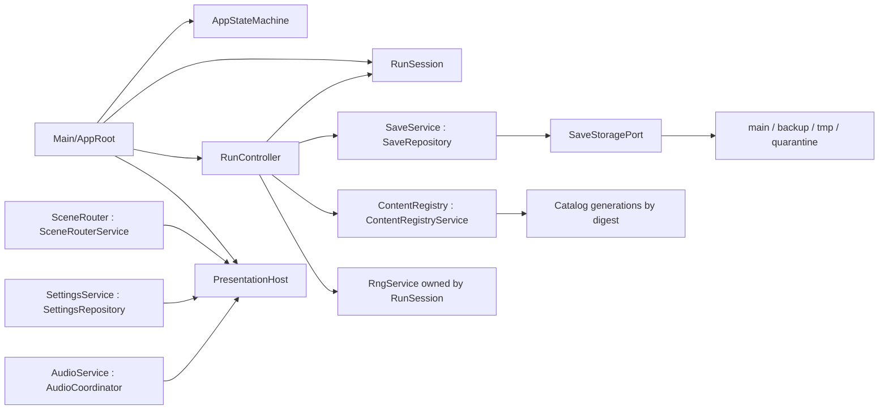

# S1 `foundation-core` 技術設計

> 狀態：`Approved / Implementation gate passed`
> 建立日期：2026-07-13
> 需求：[requirements.md](requirements.md) · 任務：[tasks.md](tasks.md)
> 權威章節：[§8 技術架構](../../docs/game-architecture/05-technical-architecture.md#section-8) · [§9 Stable ID、亂數與存檔](../../docs/game-architecture/06-data-rng-and-save.md#section-9) · [§11 測試](../../docs/game-architecture/08-testing-and-acceptance.md#section-11)

## 1. 設計目標

S1 建立所有後續 gameplay 切片共用的決定性、內容、資料、狀態與持久化 substrate。設計優先序固定為：

1. 相同 typed state、content digest、版本與 seed 產生逐位相同結果。
2. 所有 canonical state 變更必須可驗證、可原子保存、失敗時零 mutation。
3. Authoring Resource、consumer view、runtime DTO 與 JSON 各自有單一清楚邊界。
4. 正常資料錯誤回具名結果；assert 只保留給不可恢復的 programmer invariant。
5. S1 不以 placeholder 回傳值模擬尚未存在的戰鬥、商店、效果或正式內容。

## 2. 整體組裝

### 2.1 執行期拓撲



`AppRoot` 是 `RunSession`、`RunController` 與 `RngService` 的 composition root；`RngService` 不是 Autoload。SceneRouter 只能替換 `PresentationHost` 子樹，不得替換 `Main` 或 `AppRoot`。沒有全域 SignalBus 或 Service Locator。

### 2.2 專案分區

實作採下列邊界；可在分區內按型別拆檔，但不得跨區循環依賴：

```text
res://
  app/                     # Main、AppRoot、AppStateMachine、組裝
  domain/common/           # U64、ID、codec、具名 result/error
  domain/run/              # DTO、RunSession、RunController、state machine
  content/definitions/     # authoring Resource 與 typed operation subresource
  content/registry/        # compiler、catalog generation、ContentRef/view
  content/validation/      # §11.2 validator
  services/                # Save、Settings、Audio、SceneRouter
  tests/{unit,integration,fixtures,runners}/
  addons/gut/              # vendored GUT 9.7.1
  artifacts/test/          # gitignored runner artifact
tools/                     # PowerShell wrappers 與 toolchain/spec checks
```

依賴方向為 `app → domain/service/content`、`service → domain/common`、`content → domain/common`。Save 的內容 receipt 查詢是唯一額外邊，且只能依賴 `services/save/PinnedCatalogReceiptPort` 的 RefCounted abstraction；`app` 注入由 content registry 包裝成的 adapter，SaveRepository 不 import registry、autoload instance或 Resource。`domain` 不得依賴 app、presentation、Node 或 autoload instance；測試以 constructor injection 組裝 service。

## 3. Godot 與工具鏈

### 3.1 主場景與 Autoload

`project.godot` 的 main scene 固定為 `res://app/main.tscn`：

```text
Main (Node)
└── AppRoot (Node, app_root.gd)
    └── PresentationHost (Control)
```

Autoload 實例與實作型別固定如下，instance name 不得出現在任何 `class_name`：

| Autoload instance | Script class_name | 啟動責任 |
|---|---|---|
| `ContentRegistry` | `ContentRegistryService` | BOOT 載入、驗證、編譯 catalog。 |
| `SaveService` | `SaveRepository` | 存讀、migration、backup；不改 domain 規則。 |
| `SettingsService` | `SettingsRepository` | 顯示、音量、輸入偏好。 |
| `AudioService` | `AudioCoordinator` | bus、音樂與 SFX 呈現。 |
| `SceneRouter` | `SceneRouterService` | 只替換 PresentationHost。 |

Autoload 依上表順序註冊。ContentRegistry 或 SaveService BOOT 失敗時 AppRoot 不建立 RunSession，而是留在 BOOT 並顯示最小 typed fatal diagnostic。

### 3.2 版本鎖

根目錄 `toolchain.lock.json` 使用 UTF-8 JSON 並固定：

```json
{
  "godot": {
    "version": "4.7.stable.official",
    "sha256": "b2ca888d5115a6cedee564764a2ee494a625f2ec2edbabd010fe33c9a88a6bf8"
  },
  "gut": {
    "version": "9.7.1",
    "tree_sha256": "94cfb2346fa189bb358a499179161cabf6c3602485ce7f592683d5d3bb7f18d2",
    "source": "vendored"
  }
}
```

`E:\Gut-9.7.1\addons\gut` 只作一次性輸入，內容原樣複製至 `res://addons/gut`，並在 vendor 目錄保留 upstream MIT license；lock、README、腳本與 project setting 不得寫入該絕對路徑。tree hash 算法固定為：列舉所有 file、把相對路徑分隔符正規化成 `/`，拒絕 non-ASCII path 與 ASCII case-fold collision，再以「ASCII lowercase path bytes、原始 UTF-8 path bytes」作 primary/tie-break key 排序；aggregate hasher 對每檔依序餵入 `UTF-8 original_relative_path + NUL + raw file bytes + NUL`，最後輸出 lowercase SHA-256。不得使用 locale/culture sort、ordinal-only sort、逐檔 digest 或換行；此算法對核定 259 檔必須得到 `94cf...`。

工具腳本只使用本機已存在的 Windows PowerShell 5.1，以 `powershell.exe -NoProfile -ExecutionPolicy Bypass -File` 呼叫，不依賴 `pwsh`、`Process.Kill(true)` 或 PowerShell 7 API。`tools/run-tests.ps1` 的 executable 解析順序只有：明確 `-GodotPath`、環境變數 `GODOT_BIN`；兩者皆無或雜湊不符即回 3。版本 gate 以 executable 的 PE `ProductVersion` 精確比對 `4.7.stable.official`；`--version` 的 commit suffix只寫入診斷。

wrapper 使用 PS 5.1 相容的 Windows command-line quoting helper，將每個 argument 的反斜線與雙引號依 `CommandLineToArgvW` 規則編成單一 `Start-Process -ArgumentList` 字串，確保含空白 path不拆參數。以 `Start-Process -PassThru -WindowStyle Hidden` 啟動 Godot `--headless --path <repo> --log-file <artifact>`，再呼叫 `WaitForExit(timeout_ms)`；timeout 時執行 `taskkill.exe /PID <pid> /T /F`、等待回收並回 124。child 的 0/2/3 原樣傳回，其他 exit code 映射為 3。外層每次都原子寫入並讀回 `artifacts/test/runner-execution.json`；timeout／啟動前錯誤只記在此 execution artifact，主要 runner artifact（尤其 JUnit）可不存在但不得偽造通過。repo 不保存使用者路徑。

## 4. 決定性共用核心

### 4.1 `U64Bits`

`U64Bits` 是 `RefCounted` value object，私有欄位為 `hi: int`、`lo: int`，各自只允許 `0..0xffffffff`。constructor 與所有 operation 回傳新物件，不修改 receiver；公開 getter 只回 int 副本。

固定 API：

```gdscript
class_name U64Bits
static func from_hex(value: String) -> U64ParseResult
static func from_u32(high: int, low: int) -> U64CreateResult
func to_hex() -> String
func add(other: U64Bits) -> U64Bits
func multiply(other: U64Bits) -> U64Bits
func bit_xor(other: U64Bits) -> U64Bits
func bit_or(other: U64Bits) -> U64Bits
func shift_left(count: int) -> U64ShiftResult
func logical_shift_right(count: int) -> U64ShiftResult
func low_u32() -> int
func equals(other: U64Bits) -> bool
```

- `multiply` 把兩個 u64 拆成四個 16-bit little-endian limb，以 int 乘積與 carry 計算，只保留低四 limb；任一中間值必須小於 GDScript signed 64-bit 上限。
- shift 只接受 `0..63`；以 hi/lo 交叉拼接，不對負 int 使用 `>>`。count=0 回 value copy，32 與 63 有獨立邊界測試。
- `to_hex` 恆為 16 字元小寫且無 `0x`；`from_hex` 嚴格拒絕長度、大小寫、符號與非 hex。
- u32 rotate 以兩個非負 32-bit 值和遮罩組合；rotation count 僅取低 5 bit。

### 4.2 Stable ID

`StableIdValidator` 預編譯 `^[a-z][a-z0-9_]*\.[a-z][a-z0-9_]*$`。內容 stable ID 全域唯一，published ID ledger 同時保存 active、alias source 與 tombstone，三者不得重用。alias graph 以 DFS 驗證無循環且終點恰為 active 或 tombstone；顯示 key、檔名與 stable ID 不互推。

執行期 instance ID 用 prefix 加 16-hex serial，例如 `u_...`、`it_...`；serial 只有在候選 SaveRoot 成功提交後前進，`ffffffffffffffff` 不 wrap、回 typed exhaustion error。

### 4.3 RuntimeKeyCodec v1

`RuntimeKeyToken` 是 sealed-style base class，只有 `KeyKindToken`、`EnumToken`、`StableAsciiToken`、`FixedHexToken`、`U64Token`、`NonNegativeIntToken` 六個 subclass；每個 subclass 自行驗證並輸出 canonical ASCII bytes。`RuntimeKeyTuple` 保存 key kind 與 `Array[RuntimeKeyToken]`，不得以 Dictionary 或已拼接 String 當來源；raw token-array constructor 只限 codec private/test，不是 production public API。

`RuntimeKeySchemaRegistry` 固定提供六個 typed builder，逐 kind 鎖定 field count/tag/order，不允許呼叫端自行排列：

| kind | builder 欄位（依序） | tag |
|---|---|---|
| run | profile_id、next_run_serial | `h,u` |
| node | run_id、act_index、node_kind、layer_index、slot_index | `s,i,e,i,i` |
| reservation_owner | run_id、node_id、source_kind、stage_or_refresh_id、slot_index | `s,s,e,s,i` |
| transaction | run_id、node_id_or_camp、command_kind、next_transaction_serial | `s,s,e,u` |
| effect_claim | run_id、node_id、claim_scope、source_instance_or_slot、effect_id、operation_index | `s,s,e,s,s,i` |
| settlement_receipt | run_id | `s` |

`RuntimeKeyCodecV1.encode(tuple)` 固定：

1. 第一 token 為 `k:<kind>`。
2. 每 token 前置 4-byte unsigned big-endian byte length。
3. 對完整 bytes 做 SHA-256，輸出 `<kind>_<64 lowercase hex>`。
4. DTO 同存 typed tuple 與 digest；load/commit 一律重編碼比對。

run/node golden bytes 與 digest 直接取自權威 §9.1，不在程式另造第二組預期；其餘四種 builder 各有 positive 與 wrong-count/tag/order negative fixture。`RuntimeKeyLedgerValidator` 同時檢查 tuple 唯一、key 唯一、key↔payload 單射、serial 單調及 retry identity。

### 4.4 PRNG v1

`Pcg32Stream` 持有 `state: U64Bits`、odd `inc: U64Bits`、`counter: U64Bits`，公開方法與 §9.2 一致。seed 的兩次 warm-up 不計公開 counter：實作以 private `_next_raw(count_public: bool)` 避免測試外部可呼叫不計數 draw。

`next_bounded(bound: int)` 接受 `1..4294967296`；bound=4294967296 直接回 raw，其他 bound 以 `(2^32 - bound) mod bound` rejection sampling，每次 rejected raw 仍遞增 counter。非法 bound 回 `RngDrawResult.error` 且 state/counter 不變。

`RngService.derive_stream()`：

```gdscript
class_name RngService
func derive_stream(
    run_seed: U64Bits,
    stream_name: StringName,
    context_id: StringName
) -> RngDeriveResult
```

- `stream_name` 僅接受 `map`、`shop`、`reward`、`combat`；`context_id` 必須非空。
- 兩個 UTF-8 byte string 依參數順序以前置 4-byte big-endian length 編碼。
- 依 §9.2 精確執行 FNV-1a、SplitMix64 與 PCG seed；derive 是純函式，不消耗任何既有 stream。
- `RngSnapshot` 保存 `rng_version=1` 與 state/inc/counter 深拷貝；SaveJsonCodec 只以 16-hex 表示。
- production scan 禁止 `randf`、`randi`、`randomize`、`RandomNumberGenerator` 及時間/Object ID 作 gameplay entropy；profile CSPRNG adapter 是唯一例外且只產生 profile_id。

## 5. Canonical DTO 與 BattleSetup codec

### 5.1 DTO 規則

所有 runtime DTO 是 `RefCounted` typed value object，不繼承 Node/Resource。每個可變集合欄位由 constructor 複製，`deep_clone()` 逐層建立新 DTO／typed array；不得以 `duplicate()` 的預設淺拷貝取代。DTO validator 只允許明列的 S1 typed DTO、具名 result/error 與 `U64Bits` 等 value object，依其宣告欄位遞迴驗證；其他 engine `Object`（含 Node、Resource、FileAccess）、Callable、RID、Signal、Object ID、SceneTree path 與未宣告欄位一律拒絕。

S1 建立：

- `ProfileState`、`RunState`、`MapState`、`EconomyState`、`UnitPoolState`、`RosterState`、`BoardState`、`UnitInstance`、`ShopOffer`。
- `ContentSnapshotState`、`EncounterPreviewSnapshot`、`BattleSetupInputs`、`BattleSetup`、`BattleResult`、`PendingRewardState`。
- `SaveRoot`、`RunViewState`、`RngSnapshot` 與所有公開 request/result/error。

這些 DTO 在 S1 只承載規格欄位與 invariant；ShopOffer/BattleResult 不代表 S1 已產生商店或戰果。後續 service 必須使用同一 DTO，不得另建 Dictionary wire shape。

下列型別記號是 DTO 與 `SaveJsonCodec v1` 的共同 schema：`i32`/`u32` 分別限制在 signed/unsigned 32-bit；`u64` 是 `U64Bits` 且 JSON 形態固定為 16-lowercase-hex；`stable_id` 必須通過 §4.2；`runtime_id` 是已註冊 prefix 加 16-hex 或 RuntimeKey digest；`digest` 是 64-lowercase-hex；`enum<T>` 只接受列舉值；`T?` 在 JSON 明確寫 `null`，不得省略；`T[]` 即使為空也必須寫 `[]`。GDScript primitive 不以 null 偽裝 optional：每一種 optional scalar 使用獨立具名 RefCounted wrapper（`OptionalStringValue`、`OptionalStringNameValue`、`OptionalIntValue`、`OptionalBoolValue`、`OptionalBytesValue`），constructor 只接受其單一 primitive；表中的 `T?` 在 domain 即 wrapper object 或 null。所有陣列的元素是 typed class，不以 `Variant`/Dictionary 代替；set-like array 必須依欄位規定的 ASCII／數字鍵排序且拒絕重複。

#### Profile 與 Run aggregate

| DTO | 固定欄位順序／型別 |
|---|---|
| `ProfileState` | `profile_id:fixed_hex_32, next_run_serial:u64, meta_currency:u32, unlocked_content_ids:stable_id[], discovered_content_ids:stable_id[], highest_challenge_level:u32, settlement_receipts:SettlementReceiptState[], settings_ref:stable_id` |
| `SettlementReceiptState` | `key:SettlementReceiptKeyState, outcome:enum<completed/failed/abandoned>, currency_delta:i32, payload_digest:digest` |
| `RunState` | `run_id:runtime_id<run>, run_key:RunKeyState, run_seed:u64, content_snapshot:ContentSnapshotState, next_transaction_serial:u64, next_unit_serial:u64, next_item_serial:u64, commander_id:stable_id, challenge_level:u32, act_index:u32, map_state:MapState, current_node_id:runtime_id<node>?, run_phase:enum<MAP/PREPARE/COMBAT/REWARD>, expedition_hp:i32, economy_state:EconomyState, unit_pool_state:UnitPoolState, roster_state:RosterState, cleared_normal_count:u32, cleared_elite_count:u32, defeated_boss_count:u32, rng_stream_states:NamedRngState[], income_claimed_node_ids:runtime_id<node>[], loss_stipend_claimed_act_ids:u32[], reservation_owners:ReservationOwnerState[], transaction_receipts:TransactionReceiptState[], claim_receipts:ClaimReceiptState[], resolution_state:ResolutionState` |
| `ContentSnapshotState` | `content_version:string, enabled_content_ids:stable_id[], economy_config_id:stable_id, reward_table_ids:stable_id[], map_node_def_ids:stable_id[], challenge_unlock_def_ids:stable_id[], meta_reward_table_id:stable_id, manifest_digest:digest` |
| `ContentSnapshotProbe` | 與 `ContentSnapshotState` 相同的八個 scalar/typed-array欄位；僅由 SaveJsonCodec pre-decode exact-key/range/ID validator建立，沒有 resolve/view API，也不代表 snapshot 已通過 catalog 驗證。 |
| `CatalogSelection` | `content_version:string, root_enabled_content_ids:stable_id[], economy_config_id:stable_id, reward_table_ids:stable_id[], map_node_def_ids:stable_id[], challenge_unlock_def_ids:stable_id[], meta_reward_table_id:stable_id`；registry 由 root set 計算 closure。 |
| `PinnedCatalogBuildReceipt` | `catalog_schema_version:u32, content_codec_version:u32, content_version:string, selection_digest:digest, active_entry_ids:stable_id[], economy_config_id:stable_id, reward_table_ids:stable_id[], map_node_def_ids:stable_id[], challenge_unlock_def_ids:stable_id[], meta_reward_table_id:stable_id, manifest_digest:digest` |
| `RunViewState` | `publication_serial:u64, run_id:runtime_id<run>, content_manifest_digest:digest, act_index:u32, current_node_id:runtime_id<node>?, run_phase:enum<MAP/PREPARE/COMBAT/REWARD>, expedition_hp:i32, economy:EconomyViewState, roster:RosterViewState, resolution_kind:enum<idle/combat_pending/battle_result_pending/reward_pending>` |

`ProfileState` 的兩個內容 ID set 依 ASCII 排序；settlement receipts 依 key digest 排序。`RunState.run_id` 必須逐字等於 `run_key.digest`，且 SaveRoot cross-validator 要求 active run 的 `run_key.profile_id == profile.profile_id`、`run_key.next_run_serial + 1 == profile.next_run_serial`（`ffffffffffffffff` 不可建立新 run）。`RunState.rng_stream_states` 恰為 `map/shop/reward/combat` 四筆並依此固定順序；node/act claim set 依 runtime ASCII／數字排序；ledger 依 RuntimeKey digest 排序。`current_node_id` 與 `map_state.current_node_id` 必須同為 null 或相等。`RunViewState` 不是存檔欄位，`EconomyViewState`/`RosterViewState` 是相同值的唯讀 deep-copy projection，不得持有 canonical DTO 引用。

#### Map、經濟、卡池與 roster

| DTO | 固定欄位順序／型別 |
|---|---|
| `MapState` | `nodes:MapNodeState[], edges:MapEdgeState[], current_node_id:runtime_id<node>?, completed_node_ids:runtime_id<node>[]` |
| `MapNodeState` | `node_id:runtime_id<node>, node_key:NodeKeyState, def_id:stable_id, act_index:u32, layer_index:u32, slot_index:u32, node_kind:enum<normal/elite/merchant/event/rest/treasure/boss>, generated_payload_digest:digest, encounter_preview:EncounterPreviewSnapshot?, completed:bool` |
| `MapEdgeState` | `from_node_id:runtime_id<node>, to_node_id:runtime_id<node>` |
| `EconomyState` | `gold:u32, level:u32, xp:u32, win_streak:u32, loss_streak:u32, shop_refresh_index:u32, shop_offers:ShopOffer[]` |
| `ShopOffer` | `slot_index:u32, offer_id:runtime_id, unit_def_id:stable_id, cost:u32, reserved_copies:u32, reservation_owner_key:ReservationOwnerKeyState` |
| `UnitPoolState` | `entries:UnitPoolEntryState[]` |
| `UnitPoolEntryState` | `unit_def_id:stable_id, total_copies:u32, remaining_copies:u32, reserved_copies:u32, held_copies:u32` |
| `RosterState` | `board:BoardState, bench_unit_instance_ids:runtime_id<unit>[], unit_instances:UnitInstance[], item_instances:ItemInstanceState[], inventory_item_instance_ids:runtime_id<item>[], pending_item_overflow:runtime_id<item>[], active_relic_slots:RelicSlotState[]` |
| `BoardState` | `placements:BoardPlacementState[]` |
| `BoardPlacementState` | `logical_y:u32, logical_x:u32, unit_instance_id:runtime_id<unit>` |
| `UnitInstance` | `instance_id:runtime_id<unit>, def_id:stable_id, star:u32, equipment_instance_ids:runtime_id<item>[], acquired_serial:u64` |
| `ItemInstanceState` | `instance_id:runtime_id<item>, def_id:stable_id, bound_unit_instance_id:runtime_id<unit>?, acquired_serial:u64` |
| `RelicSlotState` | `slot_index:u32, relic_id:stable_id?` |

Map node 依 `act/layer/slot/node_id` 排序、edge 依 `from/to` 排序且必須形成本次已提交 DAG；每筆 `node_id == node_key.digest`，且 node key 的 run/act/kind/layer/slot 必須逐欄等於其 owning RunState 與 MapNodeState。`generated_payload_digest` 即使 node 尚無 encounter 也摘要其已生成事件/商店/獎勵 payload，阻止 load 後重抽。Shop offers 恰五格或明確空商店狀態，依 slot `0..4` 排序；refresh index 只在成功交易後前進。Unit pool 依 def ID 排序且逐 entry 滿足 `remaining + reserved + held = total`。Roster 的三個 instance/reference 集合必須互相一致；board 座標在 `0..7`、不得重疊、placement 依 `y/x/unit-id` 排序，bench 不重複 board；五個 relic slots 恰為 index `0..4`。星級只接受 `1..3`，其池中副本權重固定為 `1/3/9`。

#### RNG、RuntimeKey ledger 與 receipt

| DTO | 固定欄位順序／型別 |
|---|---|
| `RngSnapshot` | `rng_version:u32, state:u64, inc:u64, counter:u64` |
| `NamedRngState` | `stream_name:enum<map/shop/reward/combat>, snapshot:RngSnapshot` |
| `RunKeyState` | `kind=run, profile_id:fixed_hex_32, next_run_serial:u64, digest:runtime_id<run>` |
| `NodeKeyState` | `kind=node, run_id:runtime_id<run>, act_index:u32, node_kind:enum, layer_index:u32, slot_index:u32, digest:runtime_id<node>` |
| `ReservationOwnerKeyState` | `kind=reservation_owner, run_id:runtime_id<run>, node_id:runtime_id<node>, source_kind:enum, stage_or_refresh_id:runtime_ascii, slot_index:u32, digest:runtime_id<reservation_owner>` |
| `TransactionKeyState` | `kind=transaction, run_id:runtime_id<run>, node_id_or_camp:runtime_ascii, command_kind:enum, next_transaction_serial:u64, digest:runtime_id<transaction>` |
| `EffectClaimKeyState` | `kind=effect_claim, run_id:runtime_id<run>, node_id:runtime_id<node>, claim_scope:enum, source_instance_or_slot:runtime_ascii, effect_id:stable_id, operation_index:u32, digest:runtime_id<effect_claim>` |
| `SettlementReceiptKeyState` | `kind=settlement_receipt, run_id:runtime_id<run>, digest:runtime_id<settlement_receipt>` |
| `ReservationOwnerState` | `key:ReservationOwnerKeyState, unit_def_id:stable_id, reserved_copies:u32, status:enum<active/consumed/released>, payload_digest:digest` |
| `TransactionReceiptState` | `key:TransactionKeyState, payload_digest:digest` |
| `ClaimReceiptState` | `key:EffectClaimKeyState, payload_digest:digest` |

六種 key DTO 各自重建 §4.3 的 typed tuple；JSON 不保存 raw token array。decode 必須以欄位重建 tuple、重算 digest、驗證 prefix/kind/serial，然後才建立 DTO。ledger 不保存同 digest 不同 payload，active reservation 的總 copies 必須與 UnitPool/Shop/PendingReward 的 reserved copies 一致。

#### Battle、resolution 與獎勵保存形態

| DTO | 固定欄位順序／型別 |
|---|---|
| `BattleSetup` | `inputs:BattleSetupInputs, hash_version:u32, battle_setup_hash:digest, rng_version:u32, combat_rng_snapshot:RngSnapshot` |
| `BattleResult` | `outcome:enum<win/loss/draw>, final_tick:u32, survivor_instance_ids:runtime_id[], expedition_damage:u32, summary_hash:digest, run_mutation_proposals:RunMutationProposal[]` |
| `RunMutationProposal` | `operation_index:u32, operation_kind:enum<add_gold/add_xp/heal_expedition_hp>, amount:i32, claim_key:EffectClaimKeyState, payload_digest:digest` |
| `PendingRewardState` | `node_id:runtime_id<node>, stage_id:enum<standard/relic/event_grant>, phase:enum<choosing/unit_resolution/item_resolution/relic_resolution/ready_to_advance>, offers:RewardOfferState[], reserved_copies:ReservedCopyState[], selected_choice_id:runtime_ascii?, selected_unit_reservation:ReservationOwnerKeyState?, transaction_id:TransactionKeyState` |
| `RewardOfferState` | `choice_id:runtime_ascii, reward_kind:enum<unit/item/relic/gold/event>, content_id:stable_id?, amount:u32, reservation_owner_key:ReservationOwnerKeyState?, payload_digest:digest` |
| `ReservedCopyState` | `unit_def_id:stable_id, copies:u32, reservation_owner_key:ReservationOwnerKeyState` |
| `IdleResolutionState` | `kind=idle` |
| `CombatPendingResolutionState` | `kind=combat_pending, battle_setup:BattleSetup` |
| `BattleResultPendingResolutionState` | `kind=battle_result_pending, battle_setup_hash:digest, battle_result:BattleResult` |
| `RewardPendingResolutionState` | `kind=reward_pending, pending_reward:PendingRewardState` |

BattleResult 與 reward DTO 在 S1 只有 codec/validation fixture，production producer 分別屬 S2/S3。proposal 只允許權威 battle intent 白名單，不直接改 RunState。survivors、offers、reserved copies 與 proposals 分別依 runtime ID、choice ID、unit ID/owner digest、operation index 排序；同一 key/payload retry 必須 byte-identical。

`RosterState` 唯一保存 `board`、`bench`、`inventory`、`pending_item_overflow`、固定五格 `active_relic_slots`。RunState 或 SaveRoot 出現上述重複欄位即 codec validation error；RunViewState 只含 deep-copy projection。

`ContentSnapshotState` 的 validated factories 完成排序、去重及 digest 驗證後，以 repository-scanned construction seal 封存；raw constructor 只能產生 `is_validated=false` 的診斷／負向測試物件，Save 與 RunSession public path 一律拒絕，且 production source 不得直接呼叫 raw constructor或讀取 seal。new-run factory 只能接受 `PinnedCatalogBuildReceipt`；load factory 則接受 persisted scalar fields 加 registry 對同 digest 重建的 `PinnedCatalogBuildReceipt`，兩條路都執行相同 equality validator：`content_version`、`enabled_content_ids`、economy/reward/map/challenge/meta config IDs 與 `manifest_digest` 必須逐欄等於 receipt；其中 enabled IDs 恰為 active entry-index ID 全集（包含玩家可用內容及其所有規則依賴，不含 alias/tombstone source）。`RunSessionFactory` 在取得 lease 前重新執行此完整 equality check，receipt 缺失或任一欄不符皆不得建立 session 或增加 lease count。active RunState 的 instance 在該 run 生命期不替換。因此 run snapshot 不會把「完整 authoring catalog digest」誤當成「本局啟用內容 digest」。

### 5.2 Resolution tagged union

`ResolutionState` 是 abstract base，只允許：

| subclass | kind | 唯一 payload |
|---|---|---|
| `IdleResolutionState` | `idle` | 無 |
| `CombatPendingResolutionState` | `combat_pending` | `BattleSetup` |
| `BattleResultPendingResolutionState` | `battle_result_pending` | setup hash + `BattleResult` |
| `RewardPendingResolutionState` | `reward_pending` | `PendingRewardState` |

RunState 不提供任何 `is_*_pending` boolean。SaveJsonCodec 由 subclass 產生 kind；decode 先讀 kind 再只建對應 subclass，拒絕未知 kind、缺 payload、多 payload或額外 pending 欄位。

`PendingRewardState` 的 `stage_id` 僅為 `standard/relic/event_grant`，`phase` 僅為 `choosing/unit_resolution/item_resolution/relic_resolution/ready_to_advance`。constructor 驗證 nullable choice/reservation 與 phase 相容；同一時間只有一個 instance，stage advance 必須建立全新 PendingRewardState。

### 5.3 CanonicalBattleCodec v1

`CanonicalBattleCodecV1.encode(inputs)` 不呼叫 `JSON.stringify()`；它以 typed writer 依 §9.3 固定欄位順序輸出 UTF-8，整數為無前導零十進位、boolean 為 lowercase、字串使用 JSON escape、optional 使用規定 null/empty typed array。任何 float、未知 enum、未排序／重複 target 或越界 int 回 `BattleCodecResult.error`，不產生 partial bytes。

排序固定為：

- unit：`side → logical_y → logical_x → instance_id`。
- effect/modifier：`priority → source_stable_id → effect_index`。
- target ID：stable/runtime ASCII byte order排序並去重。

`BattleSetupInputs` 的唯一 enemy 欄位是 `encounter_snapshot`；不存在第二份 enemy units/traits/affixes/stage。欄位清單固定為權威 §9.3 的 11 欄，且不得包含 seed、RNG snapshot、setup hash、UI、語系或時間。

11 欄與每個 nested DTO 都由 dedicated writer 按下表順序輸出；JSON object key順序就是表列順序，array沒有省略欄位或額外key：

| DTO | 固定欄位順序／型別 |
|---|---|
| BattleSetupInputs | `setup_schema_version:int, content_version:string, manifest_digest:64hex, encounter_snapshot:EncounterPreviewSnapshot, player_units:UnitBattleSnapshot[], player_active_traits:TraitBattleSnapshot[], player_equipment_effects:BattleEffectSnapshot[], player_relic_effects:BattleEffectSnapshot[], commander_effects:BattleEffectSnapshot[], challenge_modifiers:BattleEffectSnapshot[], battle_rules:BattleRulesSnapshot` |
| EncounterPreviewSnapshot | `preview_schema_version:int, encounter_id:stable_id, manifest_digest:64hex, enemy_units:UnitBattleSnapshot[], active_traits:TraitBattleSnapshot[], affix_effects:BattleEffectSnapshot[], boss_phases:BossPhaseSnapshot[]` |
| UnitBattleSnapshot | `instance_id:runtime_ascii, unit_id:stable_id, side:player/enemy, logical_y:int, logical_x:int, star:1..3, health:int, attack:int, armor:int, magic_resist:int, attack_speed_milli:int, attack_range_cells:int, start_mana:int, max_mana:int, move_speed_milli:int, ability_id:stable_id|null, effect_ids:stable_id[]` |
| TraitBattleSnapshot | `trait_id:stable_id, tier:int, member_instance_ids:runtime_ascii[]` |
| BattleEffectSnapshot | `priority:int, source_stable_id:stable_id, source_instance_id:runtime_ascii|null, effect_index:int, effect_id:stable_id, target_ids:runtime_ascii[], integer_params:BattleIntParam[], id_params:BattleIdParam[]` |
| BattleIntParam / BattleIdParam | `key:enum, value:int`／`key:enum, value:stable_id`；key 唯一且依ASCII排序 |
| BossPhaseSnapshot | `phase_index:int, hp_threshold_bps:int, effect_ids:stable_id[]` |
| BattleRulesSnapshot | `tick_rate:int, board_width:int, board_height:int, soft_limit_ticks:int, hard_limit_ticks:int` |

unit array先依 side enum code (`player=0, enemy=1`) 再 `logical_y/x/instance_id`；trait依trait_id；effect依`priority/source_stable_id/effect_index`；phase依index；所有ID/param/member/target/effect ID set依ASCII排序且拒絕重複。codec不以Dictionary或DTO reflection決定key。decode→encode必須byte-identical；未知/缺少/額外key、錯型別、float、非法range/order/duplicate均回`BATTLE_CODEC_INVALID`。

`fixture.battle_setup_v1` 的 canonical UTF-8 固定為下列單行（1559 bytes），SHA-256=`e92f72d4c752b240aa7203c7e3899c07cfe113c4d05f5240c0e384398bcd0922`：

```json
{"setup_schema_version":1,"content_version":"fixture.1","manifest_digest":"0000000000000000000000000000000000000000000000000000000000000000","encounter_snapshot":{"preview_schema_version":1,"encounter_id":"encounter.test","manifest_digest":"0000000000000000000000000000000000000000000000000000000000000000","enemy_units":[{"instance_id":"e_0000000000000001","unit_id":"unit.foe","side":"enemy","logical_y":5,"logical_x":3,"star":1,"health":100,"attack":10,"armor":0,"magic_resist":0,"attack_speed_milli":1000,"attack_range_cells":1,"start_mana":0,"max_mana":50,"move_speed_milli":1000,"ability_id":null,"effect_ids":[]}],"active_traits":[],"affix_effects":[],"boss_phases":[]},"player_units":[{"instance_id":"u_0000000000000001","unit_id":"unit.hero","side":"player","logical_y":2,"logical_x":4,"star":1,"health":120,"attack":12,"armor":0,"magic_resist":0,"attack_speed_milli":1000,"attack_range_cells":1,"start_mana":0,"max_mana":50,"move_speed_milli":1000,"ability_id":"ability.test","effect_ids":[]}],"player_active_traits":[{"trait_id":"trait.test","tier":1,"member_instance_ids":["u_0000000000000001"]}],"player_equipment_effects":[{"priority":0,"source_stable_id":"equipment.test","source_instance_id":"it_0000000000000001","effect_index":0,"effect_id":"effect.test","target_ids":["u_0000000000000001"],"integer_params":[{"key":"amount","value":5}],"id_params":[]}],"player_relic_effects":[],"commander_effects":[],"challenge_modifiers":[],"battle_rules":{"tick_rate":20,"board_width":8,"board_height":8,"soft_limit_ticks":1200,"hard_limit_ticks":1800}}
```

S1 的 `BattleSetupInputsValidator.validate_for_build(inputs)` 是唯一 production receipt producer：先執行 typed 結構與 preview 驗證，再 canonical encode 並以 SHA-256 綁定完整 inputs，最後透過 module-private trusted authority 簽發 `BattleSetupValidationReceipt`；純 `validate(inputs)` 不簽發 receipt。`BattleSetupHashBuilder.build_from_validated(inputs, validation_receipt)` 不接受 caller 注入 authority，只接受 trusted receipt 且其 digest 必須與當次 inputs canonical digest 相同，通過後才以 `combat` + `encounter_id:battle_setup_hash` 派生 stream。production static scan 禁止 validator 以外建立 authority、呼叫 issuance／verification 或直接建 receipt；S2 提供實際 roster/board gameplay 合法性輸入與規則，但仍須走此 trusted gate。此邊界以 trusted repository code 為威脅模型，不承諾抵禦任意 mod／reflection。

## 6. 內容編譯與驗證

### 6.1 Authoring Resource

`ContentDefinition` base 欄位固定為 `id: StringName`、`schema_version: int`、`display_name_key: StringName`、typed unlock references 與 asset path references。S1 建立全部 15 種具體 Resource：`UnitDef`、`TraitDef`、`AbilityDef`、`EffectDef`、`ItemComponentDef`、`EquipmentDef`、`ConsumableDef`、`RelicDef`、`CommanderDef`、`EncounterDef`、`RewardTableDef`、`MapNodeDef`、`UnlockDef`、`EconomyConfigDef`、`MetaRewardTableDef`。

`BattleOperationDef` 與 `RunOperationDef` 是 EffectDef 的 typed subresource，沒有 stable ID；operation kind 對應具體 subclass，不用自由字串參數 Dictionary。S1 只建立資料 shape 與 validation vocabulary，不實作 EffectResolver handler。

### 6.2 `ContentCanonicalCodec v1`

codec 只接受已驗證的 typed `ContentValue`／metadata DTO，以 `PackedByteArray`、顯式 encoder 與 `HashingContext.HASH_SHA256` 實作；禁止 Resource reflection、Dictionary iteration、JSON、`var_to_bytes()`、float 或來源 property 順序。所有多位元整數是 big-endian；字串用原始 UTF-8、不做 normalization；stable ID／enum 另限 ASCII。

| Tag | 格式 |
|---|---|
| `01` | bool + `00/01` |
| `02/03/04` | i32 two's-complement／u32／u64 BE |
| `05/06/07/08` | u32 byte length + UTF-8 string／stable ID／enum／canonical `res://` path |
| `09` | raw SHA-256 32 bytes |
| `0a` | record：u16 type + u16 field count + 重複的 u16 field ID/value |
| `0b/0c` | ordered list／canonical set：u32 count + values |
| `0d` | optional：`00` 或 `01` + value |
| `0e` | raw bytes：u32 length + bytes |

record field ID 必須嚴格遞增且 schema 欄位全數存在；optional 也寫 `0d00`。未知、缺少、重複、非 canonical order、trailing bytes、scalar >1 MiB、collection >65,535 或 catalog >64 MiB 均回 codec error，decode 不得偷偷正規化。

固定 record type：`0100 EntryEnvelope`、`0101 ManifestPreimage`、`0102 CatalogEnvelope`、`0200 Alias`、`0201 Tombstone`、`0202 EntryIndex`、`1001..100f` 依下表、`2000..2fff` typed value、`3000..30ff` BattleOperation、`3100..31ff` RunOperation。entry preimage 為 `"CCE1" + Record(0100: category, stable_id, resource_schema_version, typed_payload)`；`entry_digest=SHA256(entry_bytes)`。manifest preimage 為 `"CCM1" + Record(0101: content_codec_version=1, catalog_schema_version, content_version, sorted_pack_ids, sorted_flattened_aliases, sorted_tombstones, sorted_entry_index)`；`manifest_digest` 是其 lowercase SHA-256，且是 `ContentRef` identity。S1 的 entry resource schema 與 catalog schema 均只支援版本 1；encode／decode 任一方向遇到其他版本都以固定 `entry.resource_schema_version`／`manifest.catalog_schema_version` error path 失敗，即使 manifest index 與 entry 同為未知版本也不得接受。diagnostic catalog 為 `"CCC1" + Record(0102: raw_manifest_digest, manifest_preimage_bytes, sorted_entry_bytes)`，自身 hash 不作 identity。

每個 payload 的 `0001..0003` 固定為 `display_name_key/unlock_refs/asset_refs`；其後欄位順序如下，dedicated encoder 必須逐欄寫入：

| type | Resource | type-specific fields（依序） |
|---|---|---|
| `1001` | UnitDef | cost_tier、trait_refs、base_stats、star_scalings、ability_ref?、ai_profile、basic_attack_profile、availability、shop_condition |
| `1002` | TraitDef | trait_kind、member_rule、thresholds、description_key |
| `1003` | AbilityDef | start_mana、max_mana、target_rule、cast_ticks、effect_refs、description_key |
| `1004` | EffectDef | content_role、trigger、conditions、battle_operations、run_operations、stacking、max_stacks、duration_ticks |
| `1005` | ItemComponentDef | recipe_key、sort_order |
| `1006` | EquipmentDef | component_pair、stat_modifiers、effect_refs、unique_group? |
| `1007` | ConsumableDef | use_timing、run_operations、stack_limit |
| `1008` | RelicDef | category、effect_refs、activation_limit、population_bonus |
| `1009` | CommanderDef | starting_pack、passive_effect_refs、route_preferences、population_bonus |
| `100a` | EncounterDef | encounter_kind、preview_schema_version、enemy_spawns、affix_refs、boss_phases |
| `100b` | RewardTableDef | reward_candidates、draw_count |
| `100c` | MapNodeDef | node_type、generator_ref、enter_operations、exit_operations |
| `100d` | UnlockDef | unlock_kind、challenge_level、prerequisite_refs、currency_cost、unlocked_content_refs、modifier_refs |
| `100e` | EconomyConfigDef | layer_income、interest_step_gold、interest_per_step、max_interest、gold_cap、reroll_cost、xp_buy_cost、xp_buy_amount、streak_rewards、loss_subsidy、shop_odds_by_level、pool_copies_by_tier、unit_costs_by_tier、xp_thresholds |
| `100f` | MetaRewardTableDef | node_scores、completion_reward、failure_reward、challenge_multiplier_bps |

上述每列的 type-specific field ID 都從 `0100` 起依表中文字順序逐一遞增；例如 UnitDef 的 cost/traits/base-stats/star-scalings/ability/AI/basic-attack/availability/shop-condition 恰為 `0100..0108`。不得省略空集合或 absent optional，新增／重排既有欄位必須升 codec version。nested schema 固定如下，所有 field ID 從 `0001` 逐一遞增：

| type | schema fields（依序） |
|---|---|
| `2000 UnitStats` | health、attack、armor、magic_resist、attack_speed_milli、attack_range_cells、start_mana、max_mana、move_speed_milli |
| `2001 TraitThreshold` | required_count、indexed effect_refs |
| `2002 Condition` | kind、subject、comparator、optional int_value、optional stable_id_value、optional max_uses_per_battle |
| `2003 StatModifier` | stat、mode、amount_i32 |
| `2004 ContentAmount` | content_id、count_u32 |
| `2005 WeightedEnum` | enum_key、weight_i32 |
| `2006 EnemySpawn` | side、logical_y、logical_x、spawn_key、unit_ref、star、effect_refs |
| `2007 BossPhase` | phase_index、hp_threshold_bps、effect_refs |
| `2008 RewardCandidate` | kind、optional content_ref、weight_i32、conditions |
| `2009 IntPair` | key_i32、value_i32 |
| `200a ShopOddsRow` | level、exactly-five tier_basis_points |
| `200b EnumIntPair` | enum_key、value_i32 |
| `200c ChallengeMultiplier` | challenge_level、basis_points |
| `200d StableIntPair` | stable_id_key、value_i32 |
| `200e U32Pair` | key_u32、value_u32 |
| `200f StarScaling` | star、health_bps、attack_bps、armor_bps、magic_resist_bps、attack_speed_bps、attack_range_bps、start_mana_bps、max_mana_bps、move_speed_bps |

BattleOperation record 共同 `0001=operation_index`，concrete fields 從 `0100` 起：`3001 Damage(base,scaling,damage_type,target)`、`3002 Heal(base,scaling,target)`、`3003 Shield(amount,duration_ticks,target)`、`3004 ModifyStat(stat,mode,amount,duration_ticks,target)`、`3005 ApplyStatus(status_id,stacks,duration_ticks,target)`、`3006 RemoveStatus(status_id,target)`、`3007 Move(direction_or_target,cells)`、`3008 Summon(unit_ref,count,max_active_per_source,placement_rule)`、`3009 GrantMana(amount,target)`。RunOperation共同 `0001=operation_index`，concrete fields從`0100`起：`3101 AddGold(amount,claim_scope)`、`3102 AddXp(amount,claim_scope)`、`3103 HealExpeditionHp(amount,claim_scope)`、`3104 ModifyUnitPool(unit_ref,count)`、`3105 GrantItem(content_ref,count)`、`3106 GrantRelic(relic_ref)`、`3107 PopulationSource(source_id,amount)`。unknown base operation不可直接編碼；任一既有operation schema改變必須升codec version。

collection wire tag 固定且不得依實作者選擇：所有欄名為 `effect_refs` 或 `passive_effect_refs` 的集合（含 TraitThreshold、Ability、Equipment、Relic、Commander、EnemySpawn、BossPhase）、Effect 的 operation sequence、enter/exit operations、boss phases 使用 ordered list `0b` 且 index 連續；`unlock_refs/asset_refs/trait_refs/prerequisite_refs/unlocked_content_refs/modifier_refs/affix_refs`、conditions、component_pair、stat_modifiers、star_scalings、starting_pack、route_preferences、reward_candidates、thresholds、enemy_spawns、streak/node-score/int/enum-int/stable-int/shop/pool/cost/xp rows 使用 canonical set `0c`。set 排序鍵依序為：conditions=完整encoded bytes；component pair=ID；stat=`stat/mode/amount`；star scaling=`star`；pack=`content_id/count`；route=`enum_key/weight`；reward=`kind/content_ref/weight/encoded_conditions`；threshold/row=required-count或key/level/tier；spawn=`side/y/x/spawn_key`。`ShopOddsRow.tier_basis_points` 本身是恰五項的 `0b`。entry index 先依 category code `1001..100f` 數值排序，再依 stable ID UTF-8 bytes。alias/tombstone依source/original ID；重複一律錯誤。alias先驗無循環再flatten至terminal。tombstone固定保存original ID、category、`safe_absent/safe_replace/incompatible_required` policy、optional replacement、reason code；active／alias source／tombstone namespace不得重疊。digest不含seed、generation serial、編譯時間、source path、Resource UID、mtime、locale或機器路徑。

scalar wire tag 由本段而非 Resource reflection 決定，T09 static table 必須逐欄比對：stable/content/status/effect/unit ID=`06`；localization/display/description key、spawn_key與不受stable-ID regex約束的診斷字串=`05`；enum/AI/rule/kind/scope/mode/subject/comparator/target/scaling/damage type/placement/basic-attack/shop-condition=`07`；asset path=`08`；digest=`09`；非負 count/index/tier/level/ticks/bps/star/limit/cost=`03`；可能為負的 stat/amount/delta/weight/coordinate=`02`；optional固定以`0d`包住上述inner tag。`UnitStats` 是九個 `02`；`StarScaling` 是十個 `03`。`EnemySpawn`依序是`07,02,02,05,06,03,0b`，`RewardCandidate`是`07,0d<06>,02,0c`。BattleOperation：Damage=`02,07,07,07`、Heal=`02,07,07`、Shield=`02,03,07`、ModifyStat=`07,07,02,03,07`、ApplyStatus=`06,03,03,07`、RemoveStatus=`06,07`、Move=`07,03`、Summon=`06,03,03,07`、GrantMana=`02,07`。RunOperation：AddGold/AddXp/HealHP=`02,07`、ModifyPool=`06,02`、GrantItem=`06,03`、GrantRelic=`06`、PopulationSource=`06,02`。`EnumIntPair` key=`07`，`StableIntPair` key=`06`；不存在 union key。

15 種 payload 的逐欄 wire schema 固定如下；`record<X>` 表示 `0a` 且 record type=X，`list<X>`=`0b`，`set<X>`=`0c`，`optional<X>`=`0d`。每列先隱含共同 `0001 display_name_key:05, 0002 unlock_refs:set<06>, 0003 asset_refs:set<08>`，再依列出的 `0100...` 順序編碼；此表優先於名稱推定：

| payload | type-specific field → exact wire type（依序） |
|---|---|
| `1001 UnitDef` | `cost_tier:03, trait_refs:set<06>, base_stats:record<2000>, star_scalings:set<record<200f>>, ability_ref:optional<06>, ai_profile:07, basic_attack_profile:07, availability:07, shop_condition:07` |
| `1002 TraitDef` | `trait_kind:07, member_rule:07, thresholds:set<record<2001>>, description_key:05` |
| `1003 AbilityDef` | `start_mana:02, max_mana:02, target_rule:07, cast_ticks:03, effect_refs:list<06>, description_key:05` |
| `1004 EffectDef` | `content_role:07, trigger:07, conditions:set<record<2002>>, battle_operations:list<record<3001..3009>>, run_operations:list<record<3101..3107>>, stacking:07, max_stacks:03, duration_ticks:03` |
| `1005 ItemComponentDef` | `recipe_key:05, sort_order:03` |
| `1006 EquipmentDef` | `component_pair:set<06>, stat_modifiers:set<record<2003>>, effect_refs:list<06>, unique_group:optional<06>` |
| `1007 ConsumableDef` | `use_timing:07, run_operations:list<record<3101..3107>>, stack_limit:03` |
| `1008 RelicDef` | `category:07, effect_refs:list<06>, activation_limit:03, population_bonus:02` |
| `1009 CommanderDef` | `starting_pack:set<record<2004>>, passive_effect_refs:list<06>, route_preferences:set<record<2005>>, population_bonus:02` |
| `100a EncounterDef` | `encounter_kind:07, preview_schema_version:03, enemy_spawns:set<record<2006>>, affix_refs:set<06>, boss_phases:list<record<2007>>` |
| `100b RewardTableDef` | `reward_candidates:set<record<2008>>, draw_count:03` |
| `100c MapNodeDef` | `node_type:07, generator_ref:06, enter_operations:list<record<3101..3107>>, exit_operations:list<record<3101..3107>>` |
| `100d UnlockDef` | `unlock_kind:07, challenge_level:03, prerequisite_refs:set<06>, currency_cost:03, unlocked_content_refs:set<06>, modifier_refs:set<06>` |
| `100e EconomyConfigDef` | `layer_income:set<record<200e>>, interest_step_gold:03, interest_per_step:03, max_interest:03, gold_cap:03, reroll_cost:03, xp_buy_cost:03, xp_buy_amount:03, streak_rewards:set<record<200e>>, loss_subsidy:set<record<200e>>, shop_odds_by_level:set<record<200a>>, pool_copies_by_tier:set<record<200e>>, unit_costs_by_tier:set<record<200e>>, xp_thresholds:set<record<200e>>` |
| `100f MetaRewardTableDef` | `node_scores:set<record<200b>>, completion_reward:02, failure_reward:02, challenge_multiplier_bps:set<record<200c>>` |

全部 nested record 也逐欄封閉：`2000=02×9`；`2001=03,list<06>`；`2002=07,07,07,optional<02>,optional<06>,optional<03>`；`2003=07,07,02`；`2004=06,03`；`2005=07,02`；`2006=07,02,02,05,06,03,list<06>`；`2007=03,03,list<06>`；`2008=07,optional<06>,02,set<record<2002>>`；`2009=02,02`；`200a=03,list<03>`；`200b=07,02`；`200c=03,03`；`200d=06,02`；`200e=03,03`；`200f=03×10`。所有 `300x/310x` record 的共同 `operation_index` 是 `0001:03`，concrete fields 再使用上一段已列 tag。`recipe_key` 是任意 canonical ASCII authoring key而非 stable ID；`unique_group` 與 `generator_ref` 則必須通過 stable ID validator。任何欄未出現在本表即 schema error，不得套用 fallback tag。

pair schema 也不得推定：`IntPair=02,02`、`EnumIntPair=07,02`、`StableIntPair=06,02`、`U32Pair=03,03`；`layer_income/streak_rewards/loss_subsidy/pool_copies/unit_costs/xp_thresholds` 只使用 U32Pair，`node_scores` 使用 EnumIntPair，其他欄位不得自行混用 pair schema。

golden fixture 固定為 catalog schema 1、content `fixture.1`、pack `pack.core`、alias `unit.old→unit.a`、tombstone `relic.old`（category=`relic`、policy=`safe_absent`、replacement absent、reason=`removed`），以及 schema 1 `unit.a`（display key=`unit.a.name`、cost 1、base stats `100/10/0/0/1000/1/0/50/1000`、star multipliers `1:10000×9, 2:18000×9, 3:32000×9`、無 tags/assets/unlocks/ability、AI `frontline`、basic attack `melee`、availability `player`、shop condition `always`）。兩套獨立 writer 必須重現 entry 453 bytes、manifest 254 bytes、diagnostic catalog 770 bytes及下列 golden：

```text
entry_hex=434345310a0100000400010700000004756e697400020600000006756e69742e610003030000000100040a1001000c0001050000000b756e69742e612e6e616d6500020c0000000000030c000000000100030000000101010c0000000001020a20000009000102000000640002020000000a0003020000000000040200000000000502000003e8000602000000010007020000000000080200000032000902000003e801030c000000030a200f000a000103000000010002030000271000030300002710000403000027100005030000271000060300002710000703000027100008030000271000090300002710000a03000027100a200f000a000103000000020002030000465000030300004650000403000046500005030000465000060300004650000703000046500008030000465000090300004650000a03000046500a200f000a0001030000000300020300007d0000030300007d0000040300007d0000050300007d0000060300007d0000070300007d0000080300007d0000090300007d00000a0300007d0001040d000105070000000966726f6e746c696e65010607000000056d656c656501070700000006706c6179657201080700000006616c77617973
entry_sha256=45473b5eb454fec56059d5c3cdda26787d799d3eba2a9ba2a70c185834af5f65
manifest_hex=43434d310a01010007000103000000010002030000000100030500000009666978747572652e3100040c0000000106000000097061636b2e636f726500050c000000010a0200000200010600000008756e69742e6f6c6400020600000006756e69742e6100060c000000010a020100050001060000000972656c69632e6f6c640002070000000572656c69630003070000000b736166655f616273656e7400040d000005070000000772656d6f76656400070b000000010a0202000400010700000004756e697400020600000006756e69742e610003030000000100040945473b5eb454fec56059d5c3cdda26787d799d3eba2a9ba2a70c185834af5f65
manifest_digest=a6b93f2a867be5898f8a366f0a0ce9d936106dea5aa575b46b907ddfdad2f90c
catalog_sha256=27f39e48aefa8fd81862f3a146666f7c344ab0f6c2a24e6fd79ab3340599bdf3
```

### 6.3 Catalog compile pipeline

ContentRegistry 的 compile transaction 固定為：

1. 遞迴列舉 `res://content/data/**/*.tres`，正規化 path 後排序。
2. 載入且確認為允許的 ContentDefinition subclass；原始 Resource 只留在 private authoring cache。
3. 執行 schema、stable ID、引用、operation 與 §11.2 validation；任一 error 不發布 generation。
4. 套用 typed `CatalogSelection`：BOOT latest 使用全部 active authoring IDs；建立新 run 時（S5 consumer）由 profile 解鎖、起始規則及固定 config IDs 產生 root set，再取完整 reference transitive closure。closure 缺引用或含未啟用必需內容即失敗，不發布 generation。選定的 active ID 全集排序後成為該 generation 的 entry index；不允許 compiler 偷加未列入 receipt 的 active entry。
5. 依 `category → stable_id` 排序，逐 selected Resource 編譯成對應 immutable-style `ContentValue` DTO，nested Array/subresource 全 deep copy。
6. 只用上述 `ContentCanonicalCodec v1` 計算 entry bytes/digest 與 manifest preimage/digest，並通過 golden；不得替換 JSON 或自選 codec。
7. 一次把完成的 `ContentCatalogSnapshot` 與 §5.1 exact-schema `PinnedCatalogBuildReceipt` 發布到 `_catalogs_by_digest`；只有 BOOT 全 authoring generation 以明確 `CatalogHandle` 設為 latest，run-filtered generation只由其 lease/receipt引用。舊 generation 不原地改寫。

`ContentRef` constructor 強制同時提供合法 manifest digest 與 content ID。`resolve` 從指定 generation 取 canonical value並建立新的 typed `ContentDefinitionView`；view 與 canonical entry 沒有共享 nested collection。`try_resolve` 是唯一 nullable lookup。latest 只能透過 `latest_catalog_handle()` 明確取得，不存在只傳 content ID 的 overload。

每個 active RunSession 持有其 filtered digest 的 `CatalogLease`；release 前 registry 不移除該 generation。重新啟動後 registry 必須以 persisted `ContentSnapshotProbe` 的 enabled/config/table IDs 重建 selection 與 transitive closure，再驗 expected digest；SHA-256 digest 本身絕不作為反推 selection 的輸入。若 pack 不足或重建 digest 不一致，SaveRepository 回 `run_status=incompatible_preserved`，不得 fallback latest。S1 以 internal/test-only typed `compile_pinned_generation(selection)` 驗證 full-latest 與 filtered-run digest 不混用；正式新遠征 selection producer 屬 S5，故不增加本切片公開 API。

公開 API：

```gdscript
class_name ContentRegistryService
func resolve(content_ref: ContentRef) -> ContentResolveResult
func try_resolve(content_ref: ContentRef) -> ContentDefinitionView
func validate_all() -> ContentValidationReport
func latest_catalog_handle() -> CatalogHandleResult
```

### 6.4 內容驗證器

`ContentValidator` 接受 typed `ContentValidationInput` 與 injected `ContentDependencyPort`。production port 查真實 Resource/asset/localization；test fake 可宣告 synthetic path/key 存在，因此 S1 無需加入正式美術或遊戲文字。

validator 對 §11.2 每個 invariant 配置穩定 error code、source ID/path 與 field context；一次收集所有可安全繼續的錯誤，最後排序為 `error_code → source_id → field_path`。valid fixture 是程式化 builder 產生的完整 32-unit 垂直切片資料，不放入 production registry；mutation cases 每次只破壞一種 invariant並驗證精確 error code。`content_validation_runner` 有 error 回 2，fixture/runner 壞掉回 3。

UnitDef 的 `base_stats` 九項皆為 i32，health/attack/attack-speed/range/max-mana/move-speed 必須為正，armor/magic-resist/start-mana 可為零或規格允許的負值；`star_scalings` 恰含 star `1/2/3` 各一次並依 star 排序，每一 stat multiplier 為 `1..100000` bps。S2 解析有效 stats 時以 signed 64-bit 中間值計算 `base × bps / 10000`、向零截斷並驗證結果落在 i32；star 1 不強制 10000，讓角色可明確 authoring 覆寫一星倍率。`basic_attack_profile` 與 `shop_condition` 必須是已註冊 enum；因此移速、三星規則、基本攻擊呈現與商店條件都進入 entry digest，不能在 consumer 偷補預設值。

Effect vocabulary 固定為：trigger=`battle_start/attack/hit/damaged/cast/kill/death/periodic/battle_end`；condition=`source_tag/target_tag/health_below_bps/health_above_bps/distance_at_most/distance_at_least/has_status/lacks_status/has_equipment/max_uses_per_battle`；stacking=`replace/refresh_duration/add_stacks/independent`。bps為`0..10000`、8×8 Chebyshev距離`0..7`、uses/stacks`1..99`、duration`1..1800` tick；tag/status/equipment必須是可解析stable ID。BattleOperation只允許design §6.2的`3001..3009`，amount/stat delta是i32、非負operation不得負值、move cells`0..7`、summon count/max-active`1..64`。RunOperation只允許`3101..3107`；source_context=`battle`時只可`3101..3103`且amount非負、claim_scope=`once_per_node/on_first_clear`，容量型`3104..3107`僅能來自event/reward authoring。未知enum、缺參數、越界或battle來源容量intent均依§9.1固定error拒絕。

§11.2 content count 的唯一分類如下，避免由檔名推定：玩家棋子=UnitDef availability=`player/shared`且恰32；專屬怪物=UnitDef availability=`monster`且至少12；陣營/職能=TraitDef trait_kind=`faction/role`各恰6；三標籤=player/shared UnitDef的trait_refs恰3者恰4；菁英詞綴=EffectDef `content_role=elite_affix`至少6（其他為`general`）；Boss=EncounterDef encounter_kind=`boss`恰3；事件=MapNodeDef node_type=`event`且generator_ref唯一者至少12。Relic/Commander分別至少15/恰3；component恰6；challenge=UnlockDef unlock_kind=`challenge`且level 0..5恰一、逐階前置；七節點類型由MapNodeDef node_type registry的distinct set精確等於權威七種。基礎構築=唯一unlock_kind=`base_profile`的UnlockDef至少解鎖3個distinct player unit，且其中至少一個TraitDef threshold可達。所有其餘最低量依Resource class直接計數，不把shared/boss/event重複計成另一類。

最大人口報告輸出 base cap、每個可疊加來源、version maximum 與建議壓測下限；baseline 三個 `+1` 得到 12，第四個 `+1` 得到 13，per-side 壓測下限依 `max(16, version_maximum + 4)` 由 16 提高到 17。summon operation 必須宣告正整數 `max_active_per_source`；召喚目標不得再含 summon，summon dependency graph 必須無循環。`maximum_simultaneous_entities` 固定為「version 最大玩家起始單位＋每個玩家起始單位的有界召喚總和＋所有 Encounter 中最大的敵方起始單位與其有界召喚總和」；entity 壓測下限為 `max(64, maximum_simultaneous_entities)`。缺 bound、負值、召喚鏈或循環各有獨立 mutation/error。S1 只計算報告，S2 執行實際壓測。配方驗證以 unordered canonical component pair（較小 ID 在前）證明 6-with-repetition 恰 21 組。

## 7. Save codec、migration 與 storage

### 7.1 JSON 邊界

`SaveJsonCodec` 是唯一可把 DTO 轉為 `Dictionary/Array[Variant]` 的 domain 邊界；Dictionary 不離開 services/save 內部。encode 固定根欄位順序與 schema v1，decode 拒絕未知 root 欄位、型別錯誤、額外權威欄位、非法 union、stable ID/reference、ledger 或 content snapshot。

`SaveRoot` schema v1 的欄位與順序唯一固定為：

| DTO | 固定欄位順序／型別 |
|---|---|
| `SaveRoot` | `schema_version:u32, content_version:string, app_version:string, rng_version:u32, hash_version:u32, saved_at_utc:utc_string, profile:ProfileState, run:RunState?` |

encoder 不以 reflection 或 Dictionary iteration 決定輸出；它依 §5.1、§5.2、§5.3 每張 DTO 表的欄位順序遞迴寫 JSON object。所有 required 欄位都輸出，空集合寫 `[]`、optional 寫 value 或 `null`；不得省略預設值。decode 對每一層先比對 exact key set，再依固定 schema 讀欄；未知、缺少、重複 key、float、NaN/Infinity、超出 i32/u32、錯誤 enum/prefix/order/duplicate 都回 `SAVE_CODEC_INVALID` 與 deterministic field path。JSON object key 雖不具語意順序，v1 canonical encoder 的 bytes 仍固定上述順序，read-back 以 decode→encode byte equality 驗證 canonical form。

`content_version` 在有 active run 時必須等於 `run.content_snapshot.content_version`；無 run 時等於存檔當刻明確取得的 latest catalog handle 版本。root `rng_version` 必須等於四個 named stream 與 BattleSetup snapshot 的版本，`hash_version` 必須等於所有 present BattleSetup 的版本。`saved_at_utc` 格式固定為 UTC `YYYY-MM-DDTHH:MM:SSZ`；不得帶小數秒或 offset。

所有持久 u64 恰為 16-lowercase-hex String；任何 JSON number、大小寫、符號、前綴或錯誤長度拒絕。`saved_at_utc` 只由 injected diagnostic clock 產生，不進入 digest、RNG、獎勵或比較 state equivalence。

### 7.2 Migration

`SaveMigrationRegistry` 只允許連續 `n → n+1` step。S1 保留 schema 0 fixture，其與 schema 1 唯一差異是缺 `hash_version`；0→1 只補 `hash_version=1`。已是 schema 1 時 migrate 回傳原 canonical payload，不重排 gameplay arrays 或改 timestamp。

migration pipeline 為 raw parse → schema step → profile typed build → strict pre-decode raw run 的八欄 `ContentSnapshotProbe` → 經 injected receipt port 依 probe selection 重建/取得 generation 並比對 expected digest → content alias/tombstone mapping → run typed DTO build/validation。port 的跨模組 API 唯一固定為：

```gdscript
class_name PinnedCatalogReceiptPort
func compile_or_lookup(
    probe: ContentSnapshotProbe
) -> PinnedCatalogReceiptResult
```

SaveJsonCodec 提供 private `decode_profile()`、`inspect_run_content_snapshot()`、`decode_run_with_receipt()` 三段；probe 階段就拒絕 snapshot unknown/missing/duplicate key、非法 ID/order/type，但不會先建立已驗證 ContentSnapshot。`PinnedCatalogReceiptPort` 是 Save 模組擁有的 RefCounted abstract port；production `ContentRegistryReceiptAdapter` 由 AppRoot 組裝並只回 §5.1 exact-schema 的 deep-copy receipt，fresh process 即使只有 full latest 也必須能以 probe 重建 filtered generation；fake 可逐 error code 注入，不讓 SaveRepository 直接查 Autoload。`PinnedCatalogReceiptError` 只允許 `PINNED_CATALOG_PACK_MISSING`、`PINNED_CATALOG_SELECTION_INVALID`、`PINNED_CATALOG_REFERENCE_MISSING`、`PINNED_CATALOG_MANIFEST_MISMATCH`、`PINNED_CATALOG_COMPILE_FAILED`，並使用 §9 deterministic context。任一 failure 都映射成 successful profile load + `run_status=incompatible_preserved` + 同 code 的 `LoadDiagnostic`；不轉成 silent null、不覆寫原檔，也不發布失敗 generation。alias graph 解析到唯一終點；非必要 tombstone 建安全診斷 view，必要 active-run reference或 receipt/digest 缺失時同樣隔離 raw run、不建立 typed object，原始檔路徑記入 LoadResult。缺 step、alias cycle 或必要內容缺失不覆寫來源。

### 7.3 SaveStoragePort

`SaveStoragePort` 是 `RefCounted` abstract adapter，production 為 `FileSaveStorage`，測試為 `FakeSaveStorage`。介面分離：directory/exists、open-write、write-buffer、flush、close、open-read/read-all/close、atomic rename、quarantine、restore、remove。main/backup/tmp/old/quarantine 全部由同一 `user://saves/` directory 解析並驗證在同一 volume，禁止跨 volume rename。所有可觀察 engine Error 轉 `StorageResult`；Godot `flush()/close()` 的 void 語意不得偽造成 Error，production 以 handle `get_error()` 與後續 length/bytes/parse/digest read-back 驗證，fake close fault 透過截斷或未落盤在同一 read-back 點被觀察。

Fake port 不使用會漏步驟的封閉 enum，而以 typed `StorageFaultKey(operation_kind, logical_path, occurrence)` 注入；operation kind 固定涵蓋 `DIRECTORY/EXISTS/OPEN_READ/READ/OPEN_WRITE/WRITE/FLUSH/CLOSE/RENAME/QUARANTINE/RESTORE/REMOVE`，logical path 固定為 `main/backup/tmp/old/quarantine`，occurrence 從 0 單調。save/load/repair 對 main/backup validity 的每次 open/read、tmp/final read-back及每次 rename/restore 都寫 ordered journal；測試先從無故障 run 取得完整 invocation matrix，再逐 invocation 注入，證明沒有未覆蓋或交錯。

### 7.4 原子 save 狀態機

Godot Mutex 可由同一 thread reentrant lock，因此不能把 `try_lock()` 本身當作 busy guard。SaveRepository 用短鎖保護 repository-wide `_operation_in_progress: bool`：public `save()`/`load()` 入口都 `try_lock()`，取得鎖後若 flag 已 true 就 unlock 並分別回 `SAVE_BUSY`/`LOAD_BUSY`；否則設 true 後立即 unlock，再執行 I/O。所有結束路徑都經唯一 epilogue短鎖清 flag；I/O期間不持mutex。load-triggered repair只呼叫帶private ownership token的 `_repair_while_owned()`，不得重入public save/load。Fake callback同thread重入或另一thread的save→save、save→load、load→save、repair-load→save都必須在任何storage call前busy返回，不得開始第二份journal。

固定交易：

1. deep-clone candidate，完整 validator，encode tmp bytes。
2. truncate write tmp、flush/close、重新開啟，驗證長度、bytes parse、DTO、run_id、resolution、ledger 與 canonical diagnostic digest。
3. 判定 main/backup validity：有效 main 優先；backup-only 保持原位；兩路皆不存在才是首次存檔；任一路存在但零有效 committed copy 一律拒絕並保留證據。若交易開始已有 committed copy，之後每個 fault/crash point都必須仍至少保留一份；首次存檔在 tmp→main 成功前允許零 committed，但 tmp/半檔永不算 committed，成功後 main 必須完整有效。
4. 有效 main：quarantine old、backup→old、main→backup；每次 rename 後確認至少一個有效 committed copy。backup-only：quarantine invalid main，但不移動 backup。
5. tmp→main，完整 final read-back。成功後 SaveResult 才為 success；old remove 失敗記 warning 不翻轉已驗證成功。
6. final main 無效：quarantine bad main並 restore 有效 backup；restore 失敗時 backup 留原位，回 observable failure。

load 固定先有效 main，再有效 backup。tmp、old、corrupt 只 quarantine，不當 committed；main 無效而 backup 有效時保留壞檔、載入 backup、附 recovery diagnostic，再於同一 repository operation ownership內以private repair transaction重建 main。任何修復不得先移走唯一 backup，也不得呼叫public save而與自己重入。

公開 API：

```gdscript
class_name SaveRepository
func save(state: SaveRoot) -> SaveResult
func load() -> LoadResult
func migrate(raw_json_text: String) -> MigrationResult
```

## 8. 狀態機與 RunController 交易

### 8.1 AppStateMachine

App state enum 為 `BOOT/MENU/CAMP/RUN/RESULTS`。合法 edge 固定為：`BOOT→MENU`、`MENU→CAMP`、`CAMP→MENU`、`CAMP→RUN`、`RUN→RESULTS`、`RUN→CAMP`（已提交放棄）、`RESULTS→CAMP`；載入有效 active run 是 BOOT 完成後組裝 RunSession 並進 RUN 的特殊 typed event。fatal boot 不是假狀態 edge，而是 BootResult error + fatal presentation。

### 8.2 Run phase transition

Run phase enum 為 `MAP/PREPARE/COMBAT/REWARD`。`RunEvent` 是具體 typed subclass，不含 Dictionary payload；允許 edge：

- MAP→PREPARE：已提交戰鬥節點與 EncounterPreviewSnapshot。
- PREPARE→COMBAT：已提交合法 BattleSetup/`combat_pending`。
- COMBAT→REWARD：已提交勝利 result 與第一 reward stage。
- COMBAT→MAP：已提交非 Boss 戰敗／無獎勵前進。
- COMBAT→PREPARE：已提交 Boss 戰敗且不重發收入。
- COMBAT→RESULTS（透過 AppStateMachine）：已提交遠征結束。
- REWARD→MAP／RESULTS：所有 stage/overflow 完成並提交。

S1 只實作 edge/guard/transaction infrastructure；產生合法 gameplay payload 的 command 屬 S2/S3/S4。

### 8.3 copy-validate-save-swap

`RunSession` 私有持有 canonical RunState 與 monotonic publication serial；只提供 deep-copy view/snapshot，沒有 mutable getter。RunController 的 `dispatch` 與 `transition` 共用 `_execute_transaction()`：

1. 從 RunSession 取得 deep clone draft與 pre-state diagnostic digest。
2. typed command/event 對 draft 產生 `CommandApplyResult`；future gameplay service 只能回 typed operation proposal。
3. 重算衍生值，執行 DTO、reference、ledger、state edge、serial與 RNG invariant。
4. 建立 candidate SaveRoot；呼叫 SaveRepository.save。
5. 只有 SaveResult success 才以單一 RunSession method swap，遞增 publication serial並發布新 RunViewState。

validation/migration/I/O failure 時丟棄 draft。failure result 必須帶 phase、error code 與 context；canonical state、transaction/unit/item serial、RNG snapshot、publication serial與成功 signal count皆不變。signal 只在 swap 後 emit，listener 取得的也是 deep-copy view。

`RunCommand` 是 abstract typed command contract；S1 production 不提供經濟或戰鬥 command。測試在 tests namespace 提供 `TestMutationCommand`，驗證 transaction mechanics但不編入 production content/API。

公開 API：

```gdscript
class_name RunController
func transition(event: RunEvent) -> RunTransitionResult
func dispatch(command: RunCommand) -> CommandResult
func view_state() -> RunViewState
func can_transition(event: RunEvent) -> bool
```

## 9. Result/error 契約

每個公開服務有自己具名 result 與 error enum，不共用含 `Variant value` 的萬用 Result。成功 result 的 error 為 null，失敗 result 的 value 為 null；constructor 強制互斥。必要類別至少包括：

- Content：`ContentResolveResult/Error`、`CatalogHandleResult/Error`、`ContentValidationReport/Issue`。
- Run：`RunTransitionResult/Error`、`CommandResult/Error`；`view_state()` 不可失敗，直接回 deep-copy `RunViewState`，不建立另一套 RunViewResult。
- Save：`SaveResult/Error`、`LoadResult/Error`、`MigrationResult/Error`、`StorageResult/Error`。
- RNG/U64/key/codec：各自的 parse/derive/draw/encode result/error。
- BattleSetup foundation：`BattleCodecResult/Error`、`BattleSetupBuildResult/Error`。

error 只保存基本型別、stable/runtime ID、field path 與 deterministic diagnostic code；不保存 Node、Resource、FileAccess 或原始 exception object。`try_resolve()` nullable 是唯一 optional lookup 例外；其他 null success/failure 混合形態由 API scanner 拒絕。

所有 error DTO 都有 `code:<area enum>, field_path:StringName, source_id:StringName?, diagnostic_values:DiagnosticValue[]`；`DiagnosticValue` 只有 `key:StringName` 加 `string_value:String?`、`int_value:i32?`、`u64_value:U64Bits?` 三選一，依 key 排序。storage error 另固定有 `operation_kind`、`logical_path`、`occurrence`；不得放自由格式 Dictionary、stack trace 或會受語系影響的 message。每個 result 的 exact payload 如下；`ok` 與 value/error 的互斥由 private constructor/factory 強制，表中的 `?` 只表示失敗分支為 null，不是 silent-null API：

| Result type | 固定欄位／成功值／失敗值 |
|---|---|
| `ContentResolveResult` | `ok:bool, value:ContentDefinitionView?, error:ContentResolveError?` |
| `CatalogHandleResult` | `ok:bool, value:CatalogHandle?, error:CatalogHandleError?` |
| `ContentValidationReport` | `valid:bool, issues:ContentValidationIssue[], manifest_digest:digest?`；issue=`severity/code/source_id/field_path/diagnostic_values` |
| `PinnedCatalogReceiptResult` | `ok:bool, receipt:PinnedCatalogBuildReceipt?, error:PinnedCatalogReceiptError?`；success/failure互斥，不允許 silent null |
| `RunTransitionResult` | `ok:bool, view_state:RunViewState?, error:RunTransitionError?` |
| `CommandResult` | `ok:bool, view_state:RunViewState?, error:CommandError?` |
| `CommandApplyResult` | `ok:bool, draft:RunState?, operation_receipts:TransactionReceiptState[], error:CommandApplyError?`；僅 controller private pipeline 使用 |
| `SaveResult` | `ok:bool, committed_digest:digest?, warnings:SaveWarning[], error:SaveError?` |
| `LoadResult` | `ok:bool, profile_status:enum<loaded/not_found/invalid>, run_status:enum<none/loaded/incompatible_preserved>, profile:ProfileState?, run:RunState?, preserved_source_path:String?, recovery_diagnostics:LoadDiagnostic[], error:LoadError?` |
| `MigrationResult` | `ok:bool, source_schema:SourceSchemaVersionState, target_schema_version:u32, canonical_json_text:String?, root:SaveRoot?, incompatible_content_ids:stable_id[], error:MigrationError?`；`SourceSchemaVersionState` 只有 `KnownSourceSchemaVersion(value:u32)` 與無 payload 的 `UnknownSourceSchemaVersion`，JSON parse failure 必為後者，合法 schema 0 必為前者 value=0 |
| `StorageVoidResult` | `ok:bool, error:StorageError?` |
| `StorageExistsResult` | `ok:bool, exists:bool?, error:StorageError?` |
| `StorageReadResult` | `ok:bool, bytes:PackedByteArray?, error:StorageError?`；只存在 save adapter boundary，不進 domain DTO/save |
| `StorageWriteHandleResult` / `StorageReadHandleResult` | `ok:bool, handle:StorageWriteHandle?/StorageReadHandle?, error:StorageError?`；handle private、不可越過 repository |
| `U64ParseResult` | `ok:bool, value:U64Bits?, error:U64ParseError?` |
| `U64CreateResult` | `ok:bool, value:U64Bits?, error:U64CreateError?`；任一 limb 不在 `0..0xffffffff` 時 value=null、error code=`U64_INVALID_LIMB` |
| `U64ShiftResult` | `ok:bool, value:U64Bits?, error:U64ShiftError?` |
| `RuntimeKeyEncodeResult` | `ok:bool, key_state:RuntimeKeyState?, canonical_bytes:PackedByteArray?, error:RuntimeKeyError?` |
| `RngDeriveResult` | `ok:bool, stream:Pcg32Stream?, snapshot:RngSnapshot?, error:RngDeriveError?` |
| `RngDrawResult` | `ok:bool, value_u32:U64Bits?, next_snapshot:RngSnapshot?, error:RngDrawError?`；`value_u32` 高 limb 必為零，避免 GDScript signed u32 歧義 |
| `BattleCodecResult` | `ok:bool, canonical_bytes:PackedByteArray?, inputs:BattleSetupInputs?, error:BattleCodecError?`；encode/decode factory 各只填一個成功 payload，method 型別仍為此具名 result |
| `BattleSetupBuildResult` | `ok:bool, battle_setup:BattleSetup?, error:BattleSetupBuildError?` |

`RuntimeKeyState` 是六種 §5.1 key DTO 的 sealed-style base。`SaveWarning`、`LoadDiagnostic` 與所有具名 Error 都只含上述 deterministic 基本欄位。static API scanner 必須拒絕公開 result 中的 `Variant`、Dictionary、Object、未型別化 Array，及 value/error 同時可為 null 的 public constructor。

### 9.1 Stable error vocabulary

下列 code 是 S1 公開契約；fixture 必須比對這些常數，實作者不得另造同義字串。`field_path/source_id/storage operation+logical path+occurrence` 承載細節，不藉動態拼接改 code。

| Area | 固定 code |
|---|---|
| U64/ID | `U64_INVALID_HEX`、`U64_INVALID_LIMB`、`U64_INVALID_SHIFT`、`ID_INVALID_FORMAT`、`ID_DUPLICATE`、`ID_ALIAS_CYCLE`、`ID_ALIAS_TARGET_MISSING`、`ID_TOMBSTONE_CONFLICT`、`ID_SERIAL_EXHAUSTED` |
| RuntimeKey | `KEY_KIND_UNKNOWN`、`KEY_FIELD_COUNT`、`KEY_FIELD_TAG`、`KEY_FIELD_ORDER`、`KEY_TOKEN_INVALID`、`KEY_DIGEST_MISMATCH`、`KEY_DUPLICATE_TUPLE`、`KEY_DUPLICATE_DIGEST`、`KEY_PAYLOAD_CONFLICT`、`KEY_SERIAL_ROLLBACK`、`KEY_SERIAL_EXHAUSTED` |
| RNG | `RNG_STREAM_UNKNOWN`、`RNG_CONTEXT_EMPTY`、`RNG_BOUND_INVALID`、`RNG_SNAPSHOT_INVALID` |
| Battle foundation | `BATTLE_INPUT_INVALID`、`BATTLE_PREVIEW_MISMATCH`、`BATTLE_CODEC_INVALID`、`BATTLE_VALIDATION_RECEIPT_INVALID` |
| Registry/receipt | `CONTENT_REF_INVALID`、`CONTENT_CATALOG_MISSING`、`CONTENT_ENTRY_MISSING`、`CONTENT_DIGEST_MISMATCH`、`CONTENT_VALIDATION_FAILED`、`CONTENT_CODEC_INVALID`、`PINNED_CATALOG_PACK_MISSING`、`PINNED_CATALOG_SELECTION_INVALID`、`PINNED_CATALOG_REFERENCE_MISSING`、`PINNED_CATALOG_MANIFEST_MISMATCH`、`PINNED_CATALOG_COMPILE_FAILED` |
| Save/Load | `SAVE_BUSY`、`LOAD_BUSY`、`SAVE_DTO_INVALID`、`SAVE_CODEC_INVALID`、`SAVE_NO_VALID_COMMITTED`、`SAVE_IO_DIRECTORY`、`SAVE_IO_EXISTS`、`SAVE_IO_OPEN`、`SAVE_IO_READ`、`SAVE_IO_WRITE`、`SAVE_IO_FLUSH`、`SAVE_IO_CLOSE`、`SAVE_IO_RENAME`、`SAVE_IO_QUARANTINE`、`SAVE_IO_RESTORE`、`SAVE_IO_REMOVE`、`SAVE_TMP_READBACK_INVALID`、`SAVE_FINAL_READBACK_INVALID`、`SAVE_RESTORE_FAILED`、`LOAD_NOT_FOUND`、`LOAD_NO_VALID_COMMITTED`、`LOAD_RECOVERED_BACKUP`、`LOAD_INCOMPATIBLE_RUN` |
| Migration | `MIGRATION_PARSE_INVALID`、`MIGRATION_STEP_MISSING`、`MIGRATION_ALIAS_INVALID`、`MIGRATION_TOMBSTONE_REQUIRED` |
| Run | `RUN_TRANSITION_ILLEGAL`、`RUN_COMMAND_INVALID`、`RUN_VALIDATION_FAILED`、`RUN_SAVE_FAILED` |

§11.2 invariant 固定映射：stable ID／alias=`CONTENT_STABLE_ID`；引用=`CONTENT_REFERENCE_MISSING`；asset=`CONTENT_ASSET_MISSING`；localization=`CONTENT_LOCALIZATION_MISSING`；32/cost=`CONTENT_UNIT_COUNT/CONTENT_COST_DISTRIBUTION`；6+6/三標籤=`CONTENT_TRAIT_KIND_COUNT/CONTENT_THREE_TAG_COUNT`；門檻=`CONTENT_TRAIT_THRESHOLD_UNREACHABLE`；零件/21配方=`CONTENT_COMPONENT_COUNT/CONTENT_RECIPE_COVERAGE`；各最低內容量=`CONTENT_MINIMUM_COUNTS`；七節點=`CONTENT_NODE_KIND_COVERAGE`；challenge=`CONTENT_CHALLENGE_CHAIN`；商店機率/池=`CONTENT_SHOP_PROBABILITY/CONTENT_POOL_COPIES`；reward=`CONTENT_REWARD_WEIGHT`；解鎖圖/基礎構築=`CONTENT_UNLOCK_CYCLE/CONTENT_BASE_BUILD_MISSING`；人口/實體=`CONTENT_POPULATION_BOUND/CONTENT_ENTITY_BOUND`；effect trigger/condition/operation=`CONTENT_EFFECT_TRIGGER/CONTENT_EFFECT_CONDITION/CONTENT_OPERATION_INVALID`；runtime key/digest/serial=`CONTENT_RUNTIME_KEY_INVALID/CONTENT_SERIAL_INVALID`；run intent whitelist=`CONTENT_RUN_INTENT_FORBIDDEN`。

## 10. Runner 與 artifact

### 10.1 固定入口

S1 建立並實際運作：

| Runner | S1 scope | Artifact |
|---|---|---|
| `content_validation_runner.gd` | valid + mutation fixture、§11.2 全 invariant | `artifacts/test/content-validation.json` |
| `gut_runner.gd` | unit/integration suites | `artifacts/test/gut.xml` |
| `canonical_runner.gd` | U64、RuntimeKey、PCG、BattleSetup codec golden；不報 BattleResult/event hash 通過 | `artifacts/test/canonical.json` |
| `spec_contract_runner.gd` | manifest/links/ID、公開 API、Autoload/class_name | `artifacts/test/spec-contract.json` |
| `smoke_runner.gd` | Main/AppRoot、BOOT、PresentationHost | `artifacts/test/smoke.json` |

`soak_runner.gd` 與真正 battle canonical assertions 等 S2/S3 有可執行 gameplay 後才建立；S1 artifact 必須列 `completed_scopes` 與 `deferred_scopes`，不得把 skipped 當 pass。

每個 runner 是 SceneTree `_init()` 啟動的有限 coroutine，artifact flush 後主動 quit：0=通過、2=可重現驗證失敗、3=runner/fixture/參數基礎設施錯誤；外部 wrapper timeout=124。報告都含 engine/app/schema/content/rng/hash version、開始/結束 UTC（只診斷）、case 數與失敗診斷。

GUT 固定使用 repository-owned runner，不呼叫 `addons/gut/gut_cmdln.gd`、不讓原生 0/1 exit code 或原生 file helper 擁有最終結果，也不把 GUT 設為 Autoload。每次 `Suite Gut` 先以同一 wrapper 執行 `godot --headless --import`；import 非零或 `.godot/global_script_class_cache.cfg` 仍缺失即回 3。`.gutconfig.json` 固定 dirs=`res://tests/unit,res://tests/integration`、include_subdirs=true、prefix=`test_`、suffix=`.gd`、double_strategy=`SCRIPT_ONLY`、failure_error_types=`engine,gut,push_error`、junit_xml_timestamp=false、log_level=1，且不配置 native `junit_xml_file`。

`gut_runner.gd` 載入 `gut.gd`/GutConfig，直接建立 `GutMain`、加至 root、連接 `end_run`；固定依序呼叫 `gut_config.apply_options(gut)`、在 headless 設 `gut.ignore_pause_before_teardown=true`、`GutErrorTracker.register_logger(gut.error_tracker)`，註冊成功後才開始。completion signal前不得quit；所有success/failure/exception epilogue都以finally-style路徑呼叫`GutErrorTracker.deregister_logger(gut.error_tracker)`恰一次並驗證cleanup。零executed tests回3；assertion、`push_error()`或engine error任一被tracker記錄即回2；其餘回0。runner從JUnit exporter取得XML，自行FileAccess open/store/flush/get_error/close及read-back parse；根固定`<testsuites>`，在每個immediate child`<testsuite>`首個child插入相同`<properties>`（engine/app/schema/content/rng/hash version）。寫入/read-back失敗回3。timeout時child已被殺，只有外層`runner-execution.json`必要，JUnit可不存在且不得合成假結果。

### 10.2 Spec contract

Spec runner 讀 `docs/game-architecture-spec.md` 的 `spec-manifest` JSON，驗證恰好 12 個章節、順序、相對路徑、跨檔 links、ID 唯一與 aggregate hash。另掃描 `project.godot`、`class_name`、公開 func/signal annotation、domain Dictionary exposure、禁止 rand API與 Autoload collision。規格由外部複檢核可後才把文件集狀態改為 `Approved` 並重算 manifest；runner 不自行改檔。

## 11. 驗證策略與故障案例

| 層級 | 必測內容 |
|---|---|
| Pure unit | U64 全邊界、ID、六種 RuntimeKey schema與 tuple bytes、SHA、PCG/FNV/SplitMix、bounded rejection、deep clone、codec escaping。 |
| Content | ContentCanonicalCodec golden/negative、valid synthetic catalog、每個 §11.2 mutation、A/B generation pinning、view mutation、alias cycle、人口與最大同時實體 bound。 |
| Save unit | JSON type/unknown field、每個持久 u64 欄位的六邊界矩陣、schema 0→1、alias、非必要/必要 tombstone兩分支、union、main/backup validity matrix。 |
| Save integration | 跨 thread 與同 thread storage callback 重入的 SaveBusy、無故障journal枚舉出的每個 operation/path/occurrence fault、首次/已有committed兩種 crash invariant、final read-back/restore、incompatible run 保留；四種 ResolutionState 各自重複 `save→load→retry→save→load` 後 seed/candidate/reservation/transaction/claim/receipt 與 key 數完全等值。 |
| Run integration | 合法/非法 edge、command rejection、save failure zero mutation、single swap/signal、view isolation。 |
| Static/smoke | typed API、autoload collision、forbidden dependency/rand、Main/AppRoot 路徑、headless boot。 |

所有 golden 變更都必須同時改 `rng_version`、`hash_version` 或對應 schema version及新增決策紀錄；不得只更新 fixture 讓測試變綠。

global AC 報告必須固定輸出三個互斥集合：F=`025,026,036,039,040,051,052,054,055,063,064,068,069,070,078`；X=`016,027,034,047,065,073,075`；D=`007,020,023,024,035,041,046,058,066,072,076`。runner 先驗證大小為 15/7/11 且聯集 33；S1 release gate 要求 F 全 pass、X 的 foundation assertion 全 pass且 downstream owner 保留、D 沒有 pass result。AC-075 的 canonical BattleResult 由 S2收尾；D owner 中 AC-024 固定為 S2＋橫切 UI、AC-041為S2/S3、AC-066為S2/S3/S4；其餘以 requirements §3 為準。

## 12. 需求到設計對照

| 設計區段 | 覆蓋需求 |
|---|---|
| §3 Godot/toolchain | REQ-TECH-001、REQ-TECH-005 |
| §4 決定性核心 | REQ-DATA-003、REQ-DATA-007、REQ-RNG-001、REQ-RNG-002 |
| §5 DTO/canonical | REQ-DATA-002、REQ-DATA-004、REQ-DATA-005、REQ-SAVE-005 |
| §6 Content | REQ-DATA-001、REQ-DATA-008、REQ-CONTENT-001 |
| §7 Save | REQ-DATA-006、REQ-SAVE-001、REQ-SAVE-003、REQ-SAVE-006 |
| §8 State/transaction | REQ-TECH-002、REQ-TECH-004、REQ-SAVE-002、REQ-SAVE-004 |
| §9 Result/error | REQ-TECH-003、REQ-TECH-006 |

## 13. 已鎖定假設

- S1 的 valid content 是 test fixture，不是首發內容；正式 `.tres` 由後續內容工作建立。
- schema 0 是只缺 `hash_version` 的測試已發布 fixture；schema 1 是 S1 首個 production schema。
- S1 可保存／重建 BattleSetup 與 Resolution DTO，但不產生戰鬥結果、獎勵或經濟效果。
- 只有 S1 `BattleSetupInputsValidator.validate_for_build()` 的 trusted authority 能產生 production `BattleSetupValidationReceipt`；S2 gameplay validator 不得繞過此 gate。
- 這份設計沒有留給實作者選擇的替代算法、fallback catalog、存檔覆寫策略或 silent error 行為；若實作發現 Godot 4.7 API 與此設計不相容，必須先回寫 design/DEC 並重新複檢，不得私自換語意。
